# Lip-reading-by-CNN-and-LSTM-architecture

## Introduction
  This deep learning project is about Lip Reading which is a technique of understanding speech by visually interpreting the movements of the lips so, we implemented this Lip Reading by using deep learning. It can be used for hard-of hearing people or to get some information from video without sound.
### Objective

  Lip Reading relies on the kind of the language and, in this project, **we chose Hangul as the language to implement the Lip Reading**.

  Because there were no Hangul lip datasets available for deep learning, it was necessary to create the datasets manually. Therefore, to recognize the overall general terms of language, not only does it require a large number of datasets, but also the size and complexity of the neural net increases. Due to time and hardware limitations, **this project defined the problem by classifying only a few words**.
### Precedent research & Reference

  There are some precedent researches which are related to this project as follows :
  
  * Garg Amit, Jonathan Noyola, and Sameep Bagadia. **Lip reading using CNN and LSTM**. Technical report, Stanford University, CS231n project report, 2016.
  
  * Gutierrez, Abiel, and Zoe-Alanah Robert. "**Lip Reading Word Classification**".
  
  * Parth Khetarpal, Shayan Sadar, and Riaz Moradian. "**LipVision: A Deep Learning Approach**“, International Journal of Computer Applications, 2017.
  
## Background Knowledge for Deep Learning

### What is the deep learning?

  Deep learning is defined by class of machine learning algorithms that use diverse combination of nonlinear processing for abstract. The meaning of abstract is feature extraction and transformation. In other words, **teach computer to human’s way of thinking**.
  
  Deep learning is learned by using **artificial neural network**. So, we learn about artificial neural network in the next paragraph.

### Artificial Neural Network

  Artificial neural network is imitation of biological neural network as the word itself. First we learn about an artificial neuron. The below left side picture is representation biological neuron. The neuron is an electrically excitable cell, receive electrical signals from other neurons and then give this signal to other neurons.
  
 
  

 
 
  An artificial neuron is a mathematical function expressed as a concept of biological neuron. The artificial neuron receives one or more inputs(x). There exist individual weights(w) for inputs. If receive 3 inputs, then there exist 3 weights. The summation results is total sum of input(x) multiplied by weight (w) and bias input (b). This summation is passed through a non-linear function known as an activation function (f). The result value of activation function is an output of artificial neuron. This process is expressed in an above right side picture. There is many activation functions such as sigmoid, ReLU, softmax. The output can change by activation function even if same summation.
  
 
  

 
 
  Artificial neural network is compounded of artificial neuron. Neural network is composed of layer and the layer has several neurons. There is input layer, output layer and hidden layer. Each neurons are fully-connected as above picture. If the number of hidden layer increase, the neural network is called as ‘Deep Neural Network (DNN)’. And, deep learning use this deep neural network for learning model. In hidden layer, generally use ReLU for activation function. The meaning of ‘Training’ or ‘Learning’ in the deep learning is adjustment of weights. The detailed explanation of ‘Learning’ exists below.
 
  There are many types of neural network or deep learning model. In this text, learn about CNN and RNN that are used in our model and famous models.

### Convolution Neural Network

  Convolutional neural network is a class of deep, feed-forward neural networks, generally used to analyzing visual imagery. CNN is composed of convolution layer and pooling layer, flatten layer, fully connected layer. CNN can be separated region that feature extraction of picture and region that classification. The convolution layer and pooling layer are region that feature extraction. And, the fully connected layer is region that classification. The flatten layer is located in between this regions.

 
  

**The process of convolution product by 2X2 filter with 1 stride**

 

  The image is composed of pixels. Pixel is a real number. And, each pixel express RGB 3 real numbers is color image. For example, the data shape of 24X24 pixel black and white image is (24,24,1). If the input data is image, the number of weights increase prodigiously. By this problem, calculate summation and activation function about only adjacent region. This is concept of filter. The number of filter’s weights is same as filter’s size. For example, 3X3 filter has 9 weights. The meaning of ‘Learning’ in the convolutional neural network is adjustment of filter’s weights. The filter move on input data(image) and perform convolution product. The result value is located in present filter’s location. The distance interval of filter’s moving is stride. The matrix that composed of result values is called ‘Feature Map’. The ‘Activation Map’ is a result of applied activation function on feature map. So, the output of convolution layer is activation map. There can exist several filters. The output of convolution layer is smaller than input data.

  (Padding is a method for avoid reduction of data’s size by convolution layer. Stuff a shell of data with specific value generally 0.)

  Pooling layer accept the output of convolution layer as input data. By pooling layer, the data size is reduce and some feature are extracted. One of the pooling is Max pooling. The max pooling extract maximum value in the filter size. By max pooling, can reduce noise and minor elements. The below picture represents max pooling layer.

 

 

  Flatten layer transform 2D data such as matrix to 1D data. The data must 1D shape for input data of fully-connected layer. So, flatten layer is located in between convolution layer or pooling layer and fully-connected layer.

 

 

  This above picture is basic structure of CNN. Convolution layer and pooling layer are stacked repeatedly. And the output transform 1D data by flatten layer, the transformed 1D data input fully-connected layer. The output layer apply Softmax activation function for classification.
 
  In the “Basic Keras Programming tutorial code”, you can study how to construct the CNN model in the Keras.

### Recurrent Neural Network

  Recurrent neural network is typically used to find regular pattern. Sequence is the data that important order. RNN’s input is a sequence. Recurrent neural network consider present input data and previous input data.

 

 

  The above function express RNN in formula type. h_t is the hidden layer’s parameter values at time ‘t’. x_t is input at time ‘t’. If the W is huge, the x_t is more important than h_(t-1). The W is updated for reduction of error. The below picture represents simple structure of RNN.
  
 

 

  Conceptually, RNN use two input data that are present input and previous output. LSTM is one of the RNN.

### Dataset

  We need dataset for learning of deep learning model. So, dataset is an important part of deep learning. Dataset depends on the deep learning model. If the CNN model, the dataset is composed of image. If the RNN model, the dataset is composed of sequence. The dataset is important part of deep learning. Dataset is composed of input and corresponding answer such as label. Dataset is classified training dataset, validation dataset and test dataset.

#### Training dataset

  The training dataset used for learning that is to fit the weights of model.

#### Validation dataset

  Validation dataset is used to the tune hyper-parameters for find the optimum learning method. The hyper-parameter is a parameter whose value decide learning method. The number of hidden units is one of the hyper-parameters. Also, we can decide the number of repetition learning by using validation dataset. An increment of the number of repetition learning about same dataset is not always good method. When the evaluation by validation dataset degenerate with the increment of the number of repetition learning, this phenomenon is called ‘Over fitting’. So, we need validation dataset for hyper-parameter tuning and avoid over fitting.
  
#### Test dataset

  Test dataset is independent of the training dataset. This dataset use for test deep learning model that finished learning.

### Learning (Training)

  Now, this part is detailed explanation of the ‘Learning’ in the deep learning such as, how to fit weights and process of learning.

#### Back-propagation

  The object of learning is reduction of output error. Before the learning, the weights is initialized generally 0. Choose weights and then measure the error of output. Next, update weights with reflect the error for reduce the error of output. The repetition of this process is concept of ‘Learning’.

 

 

  Back-propagation is a method of update parameter for neural network. The back-propagation using ‘Gradient Descent’ method with ‘Chain Rule’. Solve a descent of function at a point and then move the point to low gradient. Repetition of this process for the point reach extreme value is concept of ‘Gradient Descent’. For this process, we need target function. In output layer, calculate loss function between target output and estimated output by present weights. Minimize of result from the loss function is target function for neutral network. There is several loss, generally choose softmax loss for classification. This loss function apply to ‘Gradient Descent’. The chain rule is used in calculate the effect of each weight about loss.
  
#### Process of learning

  There are important factors of learning, batch size and epochs. Batch size is the number of data for once update weights. Now, express this in situation student study workbook. If the batch size is 10, student can check the answer after solving 10 problems. The update weights occur after check model output and result label. The smaller batch size, the larger number of update. Epochs is the number of repetition learning. If the 5 epochs, the model learning 5 times about same dataset. Generally, the more epochs, the better. But, not always. As mentioned earlier, there is over fitting. The performance of model depends on the learning method such as different batch size and epochs. So, decision of batch size and epochs is important part of deep learning.

  In the Keras, use the function **fit( )** for learning the model.  model.fit(x,y,batch_size=?,epochs=?)  x is input data and y is label value that correspond answer of input data. The detail of **fit( )** function and usage with example in “Basic Keras Programming tutorial code”.
  
#### Visualization of learning process

Now, explain the visualization of learning process in the Keras. In the Keras, can get history object as return value of fit( ) function. In the history object, there is training loss value and accuracy, validation loss and accuracy each epochs. Use history function for get the history object. And then, graphical presentation of this values by using ‘matplotlib’ package. The detail and usage with example code of visualization of learning process in “Basic Keras Programming tutorial code”.

## Our Deep Learning Model (CNN+LSTM)

### Transfer learning

  First, learn about the transfer learning before explanation of our model architecture. Using knowledge gained while solving one problem and applying it to a different but related problem is transfer learning. In other word, using the well trained model. Actually, many people don’t teach the model about CNN from the beginning. Because of the time and almost problem can solve by using already learned model. The important thing in here is that using transfer learning for similar model. There is well trained CNN model such as VGG and MobileNet.
  
### Model Architecture

  We use CNN and LSTM with several dense layer for lip reading. For lip reading, must realize the change of lip shape. So, we choose CNN and LSTM. CNN is realize lip shape and then each of the output of CNN become transform to sequence. Finally, LSTM realize pattern the sequence that contain the change of lip shape. Using this difference of sequences to classification.
  
 

**Simple Model Architecture**

 

 The above picture is simple architecture of our model. First, we transform the lip video to several frame images. We used the several frame images as input. Each fame image passes through the already trained CNN architecture. And then the output of CNN passes through Dense layer for transforming to LSTM layer input. The output of LSTM layer become next dense layer input. Finally, receive the output label by softmax activation function. Our train region is dense layer of CNN architecture to end part. This region is conceived in the above picture.
 
  We judged that the extraction feature of lip shape is almost same as the extraction feature of appearance. So, we decide using the transfer learning form the ImageNet trained model. And then only train the dense layer in the CNN. We choose the MobileNet for transfer learning model. MobileNet is compact model and user can resize within regular range. When we use VGG model, take about 3 hours for one epochs on our dataset and error occurred in LSTM layer. But, it take about 15 minute for one epochs. As a result, we choose MobileNet.
  
   For reading data, firstly counting each label’s number of dataset. And then, pile the lip shape image along the TimeSteps. For Keras input, transform the list to Numpy array. Finally, shuffle data and make batch for training. The final shape of dataset is (586,20,128,128,3) 586 is the number of datasets and 20 is TimeSteps(frame), 128X128 is size of image. 3 is the channels. (Color image)
   
   The region for making TimeSteps is composed of MobileNet and dense layer. In the dense layer, applied drop out. Drop out is one of the method to avoid over fitting. The output of this region enter LSTM layer as input. Output of LSTM passes through dense layer with one more drop out. Finally, the classification label is output. The detailed model architecture is conceived in below picture.

 

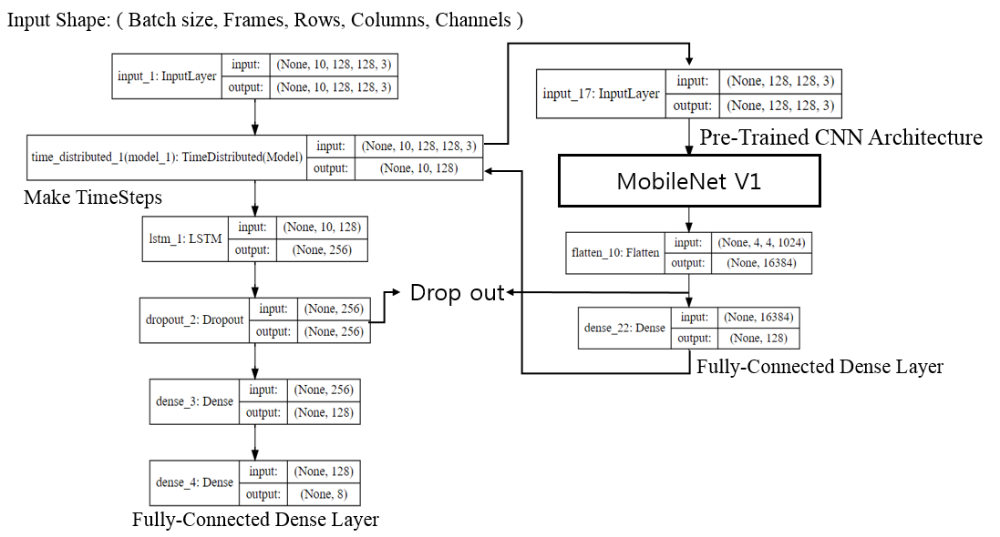
**CNN + LSTM Model Architecture**

 

## Environment Setup

### Anaconda Installation

Anaconda is a free distribution of the Python language. It provides an individual virtual environment for each project and automatic package management. It also offers a wide variety of python applications such as jupyter notebook, spyder, and so on. 

1. Access https://www.anaconda.com/download/ and download Anaconda setup file.

 

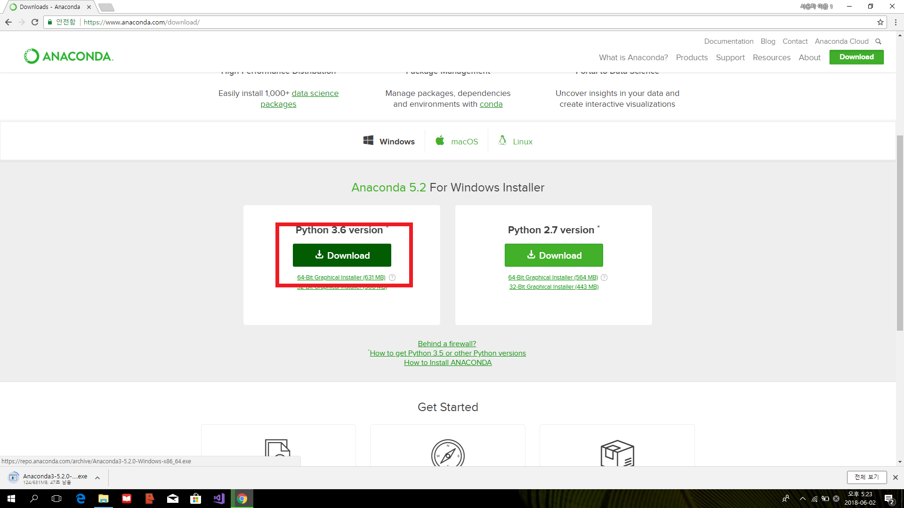

 

2.	Open Anaconda setup. Proceed installation by following instructions in the setup program. You can either choose or not choose the several options.

 

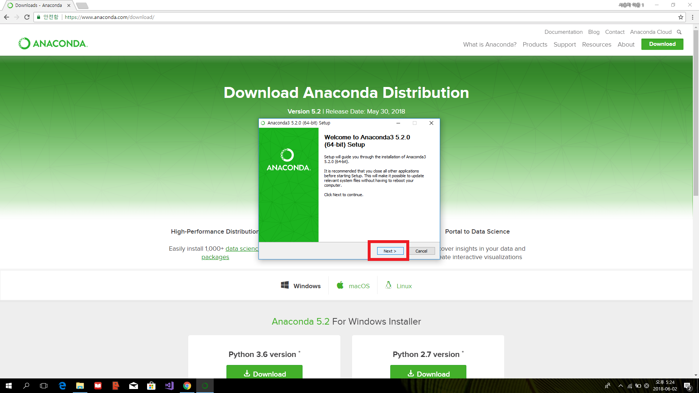

 

3.	Start Anaconda Navigator. At the environment tab, you can manage environments and installed packages. You can create and use multiple environments in the Anaconda. Create a new environment that will be used for the course project. 

 

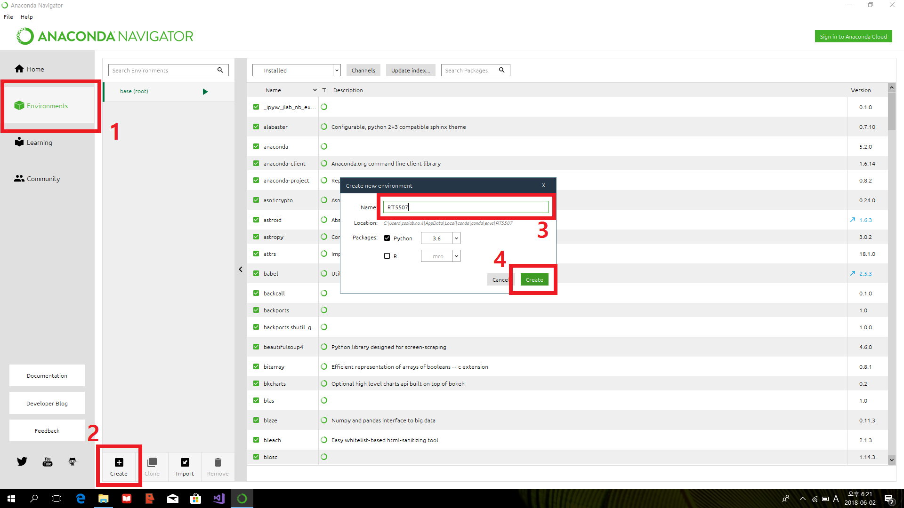

 

4.	Install packages in the created environments. Find numpy among the packages that are not installed. Repeat the same job for matplotlib, opencv, tensroflow, and keras. Simply checking those five packages is enough, other dependent packages required will be added automatically when you enter apply button.

 

 

 

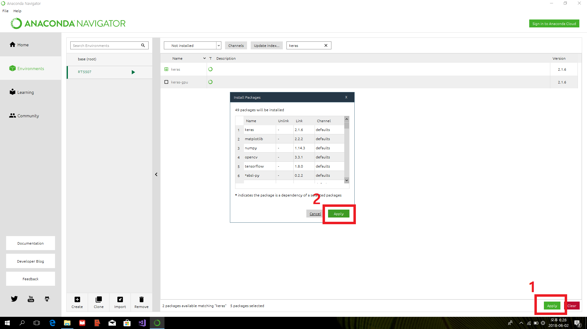

 

5.	At the home tab, you can check the applications installed in the environment. Install Jupyter notebook, together with other applications you may want, among the application lists.

 

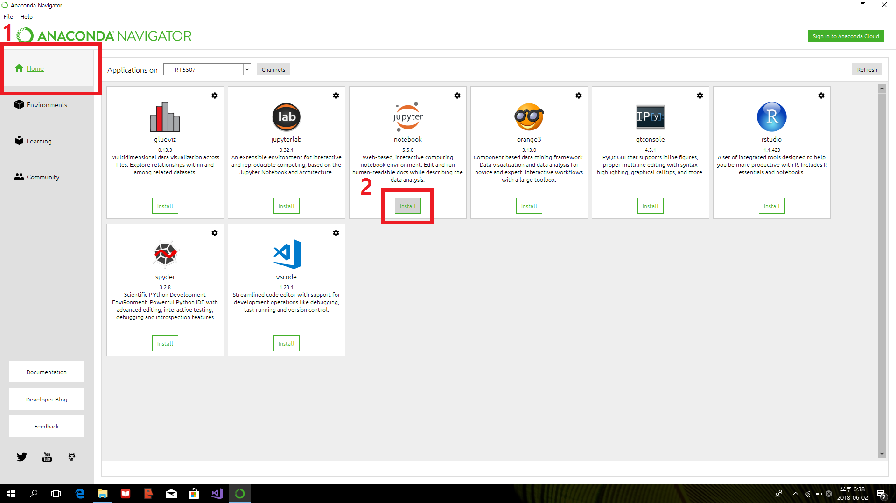

 

6.	Open Jupyter notebook and create a new python3 file for the test.

 

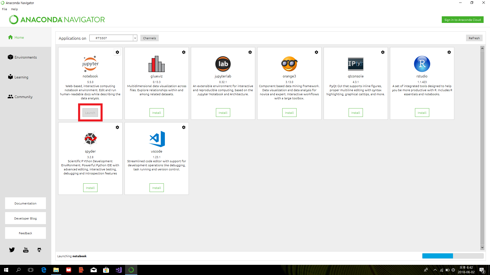

 

 

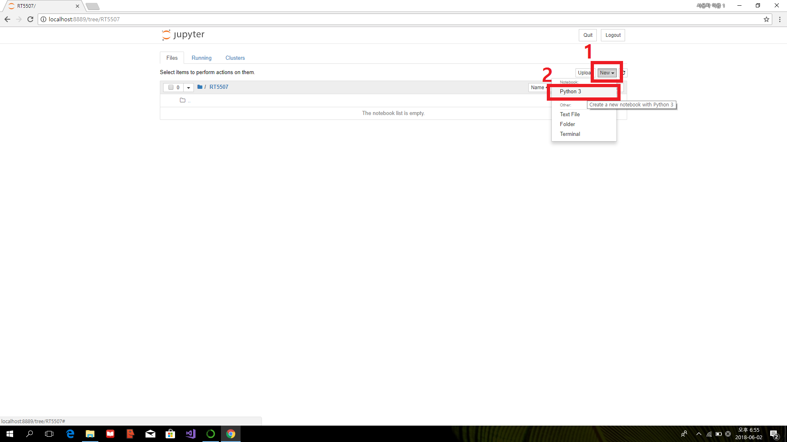

 

7.	Verify whether python module packages are successfully installed by importing those modules and checking the package version.

 

 

## Dataset Preparation

  As suggested in introduction, we had to manually create few lip motion datasets for the training of our model. We selected the 7 most frequently used words in the news. Also, a default set was prepared for lip motion excluding these seven words. Therefore, 8 labels were prepared; 미국(America), 국회(Congress), 기자(Journalist), 뉴스(News), 북한(North Korea), 대통령(President), 오늘(Today), 디폴트(Default). If you want, you can select more words, but it will be more difficult to collect datasets. 
  
  Because there is a large variation in the way of pronouncing and mouth shape according to each individual, we collected the lip motion video of the news anchors that are supposed to use standardized pronunciation. For each label, 100 raw data were collected. (The gender ratio of the news anchors was same.) If you have enough time, it is recommended to collect more than 100 data.
  
  The raw video data had to be preprocessed appropriately for the training of the deep learning model. Considerations in preprocessing are as follows:

 * Two ways of Lip detection which is to extract only the image of the lips (Because during the detection process something which is not lip can be detected, there are some loss of # of data)
 
 * Cropping and Resizing to be 64 x 64 RGB images.
 
 * Padding & Sampling for data (fame) normalization
 
 * 8:2 ratio of Train/Validation set
 
### Raw Data Collection

 

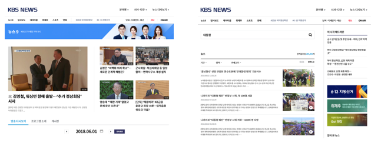

 

  To collect raw video data, you can use the news homepage of any broadcaster like KBS, MBC, JTBC, etc. If you search the selected words in the search box, you can find the news video that speaks the word. By using some video capture software program like Bandicam, you can get a avi file of video. (Search Bandicam in Naver. Because the video for lip motion of each word is just few seconds, the free trail version of Bandicam is enough.)
  
 

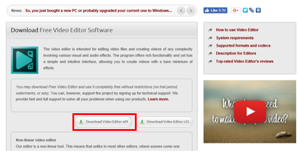

 

  It is difficult to take exact lip motion video of only the interested word by using just video capture program. Then, you can download and use Video Editor Programs like VSDC Video Editor Program which is free. (Download : http://www.videosoftdev.com/free-video-editor?AVGAFFILIATE=3305) 
  
 

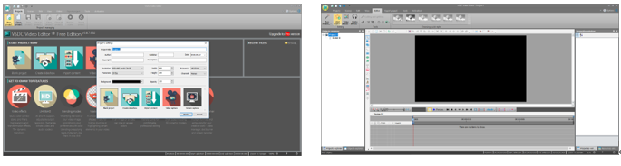

   

  After running the program, click new project and then, click finish. Then, you can use this editor. 
  
 

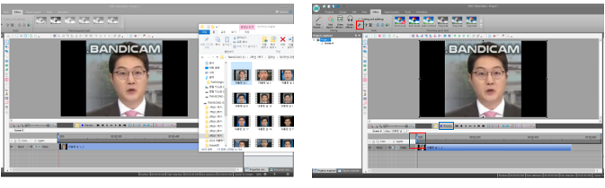

   

  You can load the video by drag avi file to the black area. Select the video by clicking the image. Then, at lower red box, you can select the section of video to edit. After select the section, you can cut the section by click the button at upper red box. You can watch the editing video by Preview button ( blue box ).
  
 

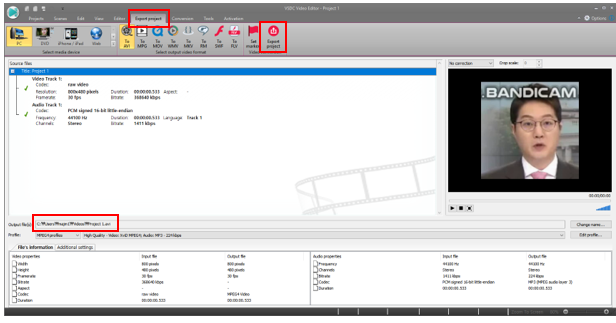

   

  If the editing is finished, you can save the avi file at export project tab. At this tab, Click Export project button then, it saves at the location of red box. You can continue editing of other video to go back the Editor tab without making new project.
  
 

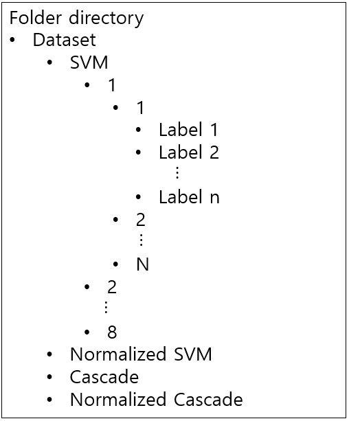

 

  Finally, to get data smoothly at training part of deep learning model, you should organize the filenames and path.

### Preprocessing dataset

  In this part, we use **Support Vector Machine** which use machine learning and **OpenCV**. It is also important part for deep learning, but we will not write on this tutorial. So, if you are interested in preprocessing part, please see '**preprocessing**' directory.
  
## Model Implementation Introduction : Keras API

  To implement the DeepLearning model of the **CNN + LSTM Architecture**, we will use **Keras**, an Open Source Neural Network Library written in Python.
  
  The reason for choosing Keras is because Keras provides an intuitive API so **that non-specialists** can easily develop and utilize **deep-learning models in their fields**, Keras has four different distinctions compared to other DeepLearning API. 

  **Modularity**: **The modules provided by Keras are independent**, configurable, and can be linked together with the minimum possible constraints. A model consists of these modules in a sequence or graph. In particular, neural network layers, cost functions, optimizers, initialization techniques, activation functions, and normalization techniques **are all independent modules and can be combined** to create new models

  **Minimalism**: Each module is **simple and compact**. All code should be understandable as well. However, repeatability and innovation may be somewhat lower.

  **Easy Scalability**: You can add modules very easily with new classes or functions. Therefore, you can make various expressions necessary for advanced research.

  **Python based**: There is no need for a separate model configuration file, and the models are defined in Python code constructed using Theano or Tensorflow.

  In addition, Keras **provides a variety of Transfer Learning** models as class functions, so we choose Keras API.

  When creating a Deep Learning model with Keras, **follow these steps**. It is similar to other DeepLearning libraries, but **much more intuitive and concise**.

 

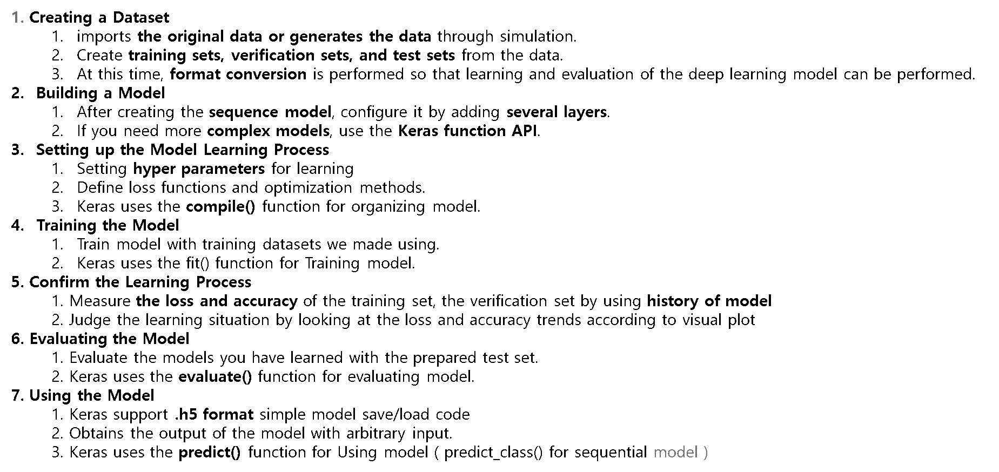

 

The upcoming Model Implementation tutorial will proceed as above.
If you are unfamiliar with using Keras, you should study the basic Keras programming process by referring to the following exercise code before learning this tutorial.

**Reference 'Basic Keras Programming Tutorial code' **

### 0. Load Keras package needed

Keras input/output data type is numpy array, because we operate the Keras based on the tensor flow, we will see the words 'Using TensorFlow backend. ‘at the first time. If this code does not work by error, check library install.

 

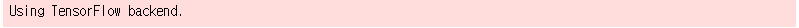

 

Fixing random seed, prevent other results from repeating in the Research.

 

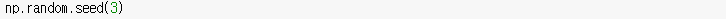

 

### 1-1. Creating Datasets

We will run the example using the most widely known MNIST dataset for beginners.
On Keras, some representative datasets are supported by the library server. By below function you can download MNIST datasets from server

 

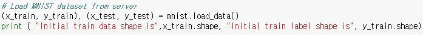

 

 

 

At this time, MNIST dataset input is ( data_size, columns, rows ) numpy array and label is 0~9 number. 

Therefore, preprocessing is necessary to match the input size of the model before using it.

 

 

 

 

By reshape() function in numpy array, we can convert input data as one dimensional array for Dense layer input and np_utils.to_categorical() is same to one_hot function that extend one dimension example from [[9]] to [[0, 0, 0, 0, 0, 0, 0, 0, 0, 1]]

### 2-1. Building a Model

Sequential model declaration allows you to define a model by specifying only the output shape of each layer without specifying the input shape. In this, input layer must have input shape or user must define input layer separately, and each layer has activation function and node number ( output dimension )

 

 

You can also visualize how your model is constructed with simple functions, no matter how you structure the model. This will ensure that your model is well organized.

 

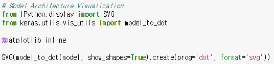

 

 

 

### 1-2. Creating Datasets

 

 

 

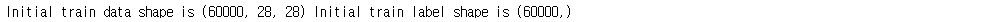

 

 

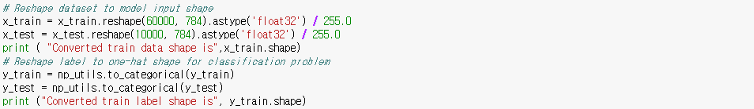

 

 

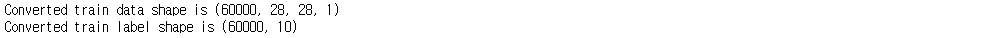

 

The configuration of the convolutional neural network can also be implemented in a way that is not significantly different. In this case, convolutional layer input must be ( batch_size, columns, rows, channels ) shape. Because MNIST dataset is gray scale, so we must add meaningless dimension

### 2-2. Buliding a Model

Convolutional neural networks, like the dense layer, must define the input shape first, kernal_size is the size of the filter, and the first variable is the number of filter channels. In order to obtain the result, it is necessary to connect the CNN code to the input of the dense layer through the platen layer.

 

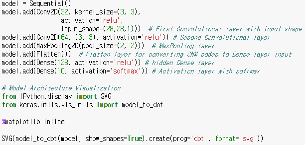

 

 

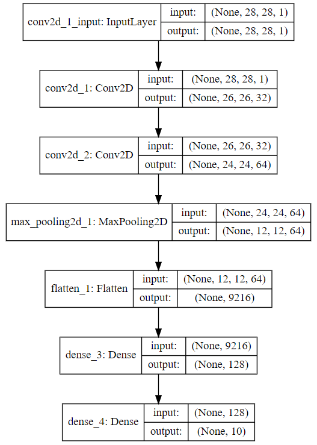

 

In this case, by visualized model, you can see 3 convolutional layers input and output shape and dense layer get 9216 CNN Code from flatten layer 

### 3. Setting up the Model Learning Process

To compile the model for training, we need to specify an optimizer. 

In this case, the man optimizer is used, and each parameter is the default setting of this optimizer.

Also, you have to define the loss function when compiling the model. In case of binary classification model, you have to specify it according to the type of output like binary_crossentropy. 

Also, the metric represents the rating scale and is usually set to accuracy.

 

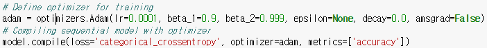

 

Before this process you must choice 1_1, 2_1 or 1_2, 2_2 model.

### 4. Training the Model

By using the fit() function to learn the model, the following learning process can be visualized and observed. you can specify several hyper parameters in the fit function, such as batch_size, validation rate, epoch, and this function returns a record that trains the model.

 

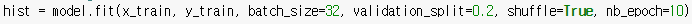

 

It should be noted that when the validation is divided, the training data must be mixed by distributing the data at a certain rate in the back of the dataset.

 

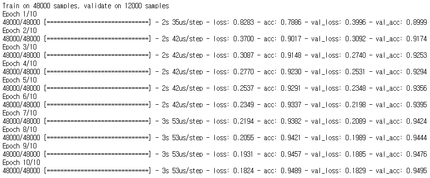

 

### 5. Confirm the Learning Process

The following code can be used to visualize the history returned earlier.

The green line represents validation Acc and the red line represents validation loss, which is an important indicator of training. If, during training, the validation loss tends to increase without further decline, the model should be discontinued because it is overfitting.

 

 

 

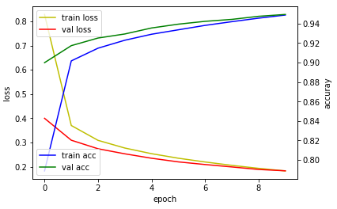

 

### 6. Evaluating the Model

 

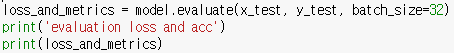

 

 

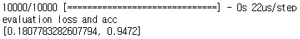

 

Unlike the fit function, this valuation function evaluates the value without learning the model. I put the test data set that I divided at the starting point, and it showed the following result.

### 7. Using the Model

To use the model, Keras provides a function to store and load the model as follows: The model is saved in h5 format along the specified path and loaded.

 

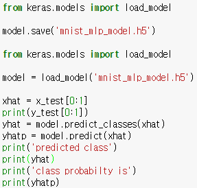

 

To use the model, two functions are given as follows: the predict function returns the result through the softmax layer, and the predict_classes function returns the column number with the greatest probability.

By using these two functions, we can get the results from the classification model.

For detailed parameter settings and functions in the above example code, visit the following web page
https://keras.io/

And, if you want to know how to implement several basic DeepLearning models, it would be helpful to refer to this blog.

https://tykimos.github.io/

## Model Implementation Introducition : Transfer Learning

 

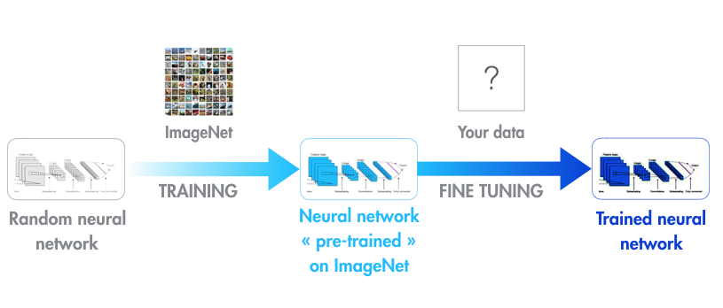

 

It is a way to speed up learning and improve predictability when creating new models using existing models. Practically speaking, there is not much to learn from the start of the Convolution network. Most problems can be solved using models that have already been learned. number of layers, activation, hyper parameters, etc., and there is a lot of effort to actually learn

When you start transfer learning, the recommended transfer learning method depends on the size and shape of your data set. We use case 1's learning method because we have a relatively small set of data and the shape of the libs is made up of different shapes that can be distinguished in the form of visual images. 

CS231n: Convolutional Neural Networks for Visual Recognition. 

http://cs231n.github.io/

 

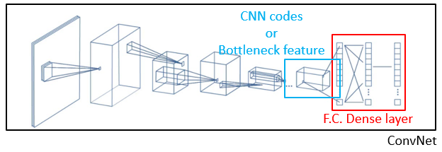

 

 

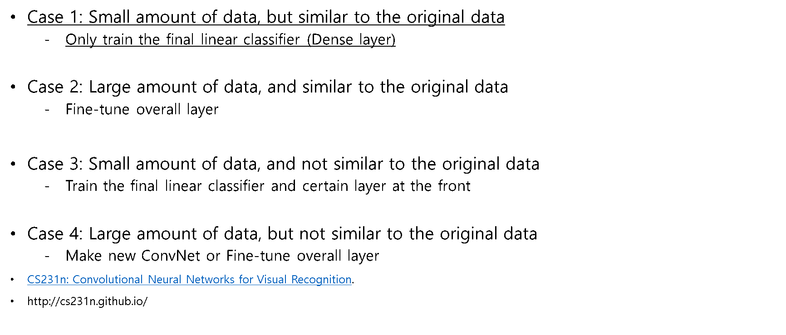

 

## Transfer Learning Introduction : VGG16

The VGG model is one of the most widely used models and is a simple model in the form of a traditional CNN. It takes a 224x224 3 channel image as input and generates 4096 CNN codes. 

The disadvantage of this model is that it has a lot of weight but it has good performance, but with a total of 138M weights, it creates a lot of memory allocation and large model.

 

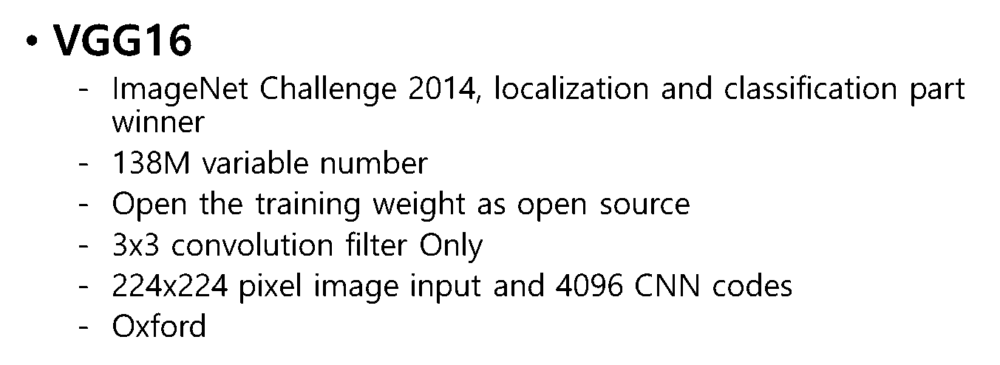

 

 

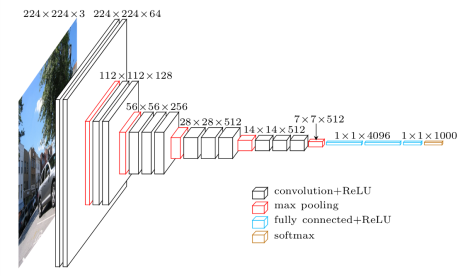

 

**Very Deep Convolutional Networks for Large-Scale Image Recognition**
Karen Simonyan, Andrew Zisserman
*(Submitted on 4 Sep 2014 (v1), last revised 10 Apr 2015 (this version, v6))*

## Transfer Learning Introduction: inception V3

The inception model evolved from the existing Google Net, and is one of the popular transfer learning models such as VGG. They have a very small number of weights (as large as 24M) and a complex convolution filter shape and model structure compared to the VGG.

 

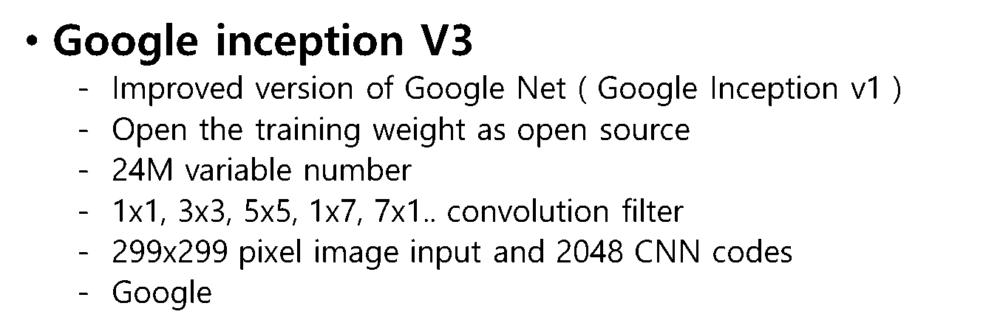

 

 

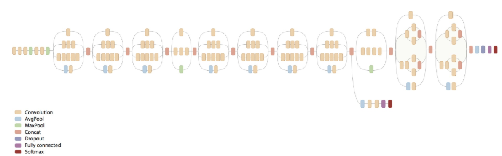

 

**Rethinking the Inception Architecture for Computer Vision**
Christian Szegedy, Vincent Vanhoucke, Sergey Ioffe, Jonathon Shlens, Zbigniew Wojna
*(Submitted on 2 Dec 2015 (v1), last revised 11 Dec 2015 (this version, v3))*

## Transfer Learning Introduction: ResNet

ResNet is a model with a unique layer structure called Identify mapping, which can effectively train deep models. The size of the model is similar to Inception v3

 

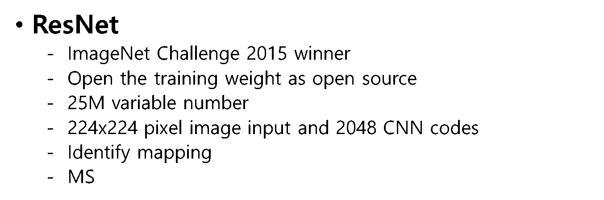

 

 

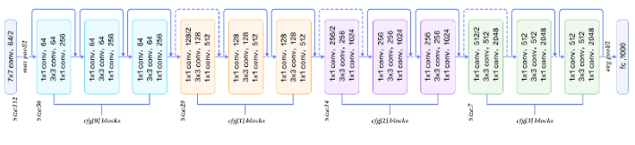

 

**Deep Residual Learning for Image Recognition**
Kaiming He, Xiangyu Zhang, Shaoqing Ren, Jian Sun
*(Submitted on 10 Dec 2015)*

## Transfer Learning Introduction: MobileNet

 

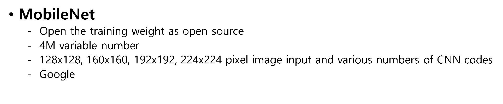

 

**MobileNets: Efficient Convolutional Neural Networks for Mobile Vision Applications**
Andrew G. Howard, Menglong Zhu, Bo Chen, Dmitry Kalenichenko, Weijun Wang, Tobias Weyand, Marco Andreetto, Hartwig Adam
*(Submitted on 17 Apr 2017)*

## Model Implementation Introduction: Transfer Learning Code

**Reference 'Transfer Learning Tutorial code'**

Keras provides all of the models described above as part of the library. We can download the weights of the above models from the server through a very simple function. We can get our CNN code as output of this model and construct our own model by connecting additional layers using Keras function.

However, since the transfer learning model does not use the sequential model structuring used in the previous example, we need to construct the model structure using the Keras API function. This is of course not difficult, it can be implemented simply by specifying the input and output layers

In this, You must know that almost transfer learning model need 3 channel input image

The code below provides a more convenient function code specific to training CNN.

### 0.Load Keras package needed

Keras has a variety of class functions, which can vary depending on the version, so it can be difficult to run code if your version does not match the Tutorial.

 

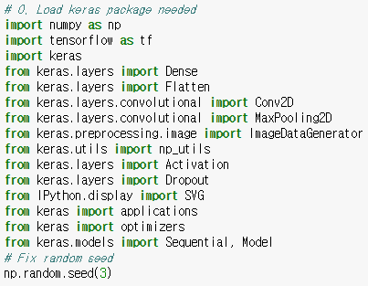

 

In this, first, we set the parameters necessary for model training. 
The meanings of the variables are as follows
batch_size: batch size for learning
num_epochs: repeat numbers of training epochs
steps_epoch: training numbers in one epoch, ex) batch_size = 10, steps_epoch = 10 than 100 data per epoch 
Val_steps: at the end of each epoch, validation test is conducted this means this step numbers
img_col: input image columns
img_row: input image rows
img_channel: channel of image, for transfer leaning in Keras, it is 3 almost
num_classes: your label numbers

 

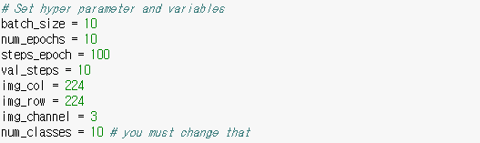

 

Note that the size of the image depends on each transferring model. VGG16 supports 224x224, inceptionV3 supports 229x229, ResNet50 supports 224x224, and MobileNet supports 128x128, 160x160, 192x192 and 224x224.
It is essential to adjust the parameters according to the type of model and the number of labels you have.

### 1.Creating Datasets

One of the most convenient features of the Keras library in CNN training is the very simple preprocessing and image processing.

 

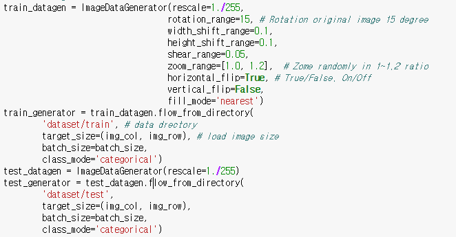

 

Keras preprocesses the image with a single function to help inflate the image set.
Image Generator allows you to set various image conversion settings as below. You can set the processing conditions of the empty space by rotation angle, left / right, up / down ratio, image shear, enlargement ratio, upside / downside, . In this case, nearest means to fill with near color
You can use the flow_from_directory function to get the data directly to the generator queue as batch size. The dataset must be stored in the subfolder structure as follows: In 'categorical' mode, the name of the folder becomes the label of each class. It also automatically adjusts the image size during the import process.

 

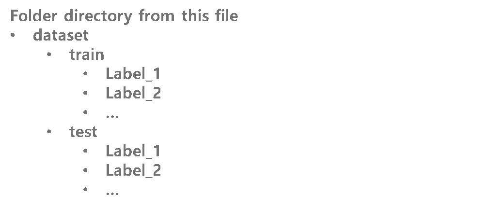

 

### 2.Building a Model

The model declaration proceeds as follows. When using the Keras API, each input and output layer address must be specified as follows so that the model is layered and the input and output layers must be explicitly specified using the last Model function to activate the fit function.

 

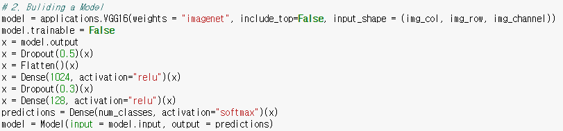

 

Let's look at the main function

 

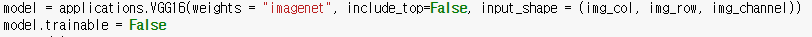

 

The application classes provide a variety of transfer learning models. It is downloaded from the server and stores multiple versions of the weights, and we take the weights used in the most typical imagenet challenge to perform examples and tasks.
In this case, you need to modify the include_top parameter according to the first case. If it is False, only the convolutional filter except the last FC-dense layer is added to the model. If True, whole model that classifying 1024 classes is downloaded.
We can also set the trainable parameters for this model by setting the trainable parameter.
Since we assume case1, we set it to False. If you want, you can check the model structure and set the training for each layer.

### 3.Setting up the Model Learning Process & 4. Training the Model

Model compilation is no different from the previous example. For this example, we used SGD as the optimizer and lr represents the learning rate.

 

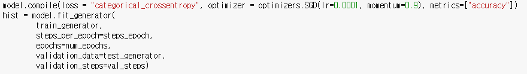

 

If you use the image generator to retrieve data in a queue format, you should use the fit_generator() function instead of the existing fit function. In this process, the model can be learned by designating the variable as the above order. In case of the train generator, it should be included.
The subsequent steps are the same as in the previous example.

## Model Implementation Lip Reading

**Reference 'Lip Reading Tutorial Traininig'**

First we introduce the simple structure of the model we will use.
We will receive the frame sequence from the image information, encode it through the CNN model, and classify the sequence using the LSTM model. In short, CNN + LSTM is our model architecture.
The visualization is as follows.

 

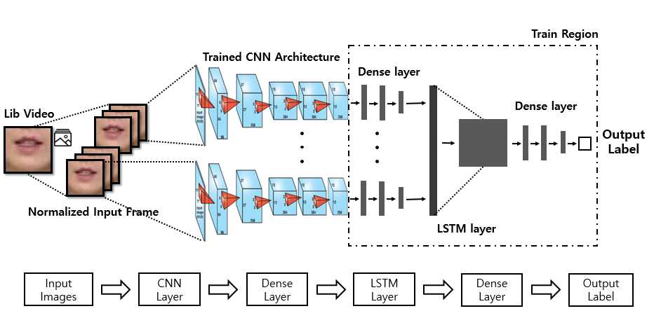

 

### 0.Load keras package needed

We need a special preprocessing process because we will use a user-created dataset rather than a formal dataset. To do this, use the OS and OpenCV libraries. Other libraries are the same as the previous example code, except for some layers.

 

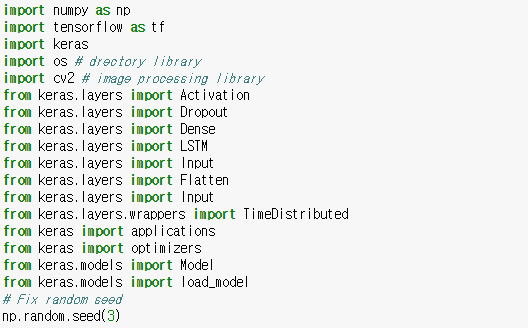

 

The following parameters are the key parameters in training the model.

 

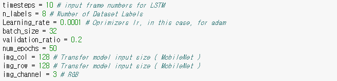

 

timesteps is the length of the input sequence into the LSTM model.
n_labels is the number of classes to predict.
Learning_rate is the variable that the optimizer will use and is now set to the default value of the adam optimizer.
batch_size is the number of data to be learned at a time
The validation_ratio is the ratio of how much of the original data set is used as the validation data set.
num_epochs means how many times to learn about the entire dataset.
img_col, img_row means the size of the image to be input to CNN, and it must be set to the size appropriate for the model used for each transfer run.
img_channel is 3, RGB scale for almost transfer learning model in Keras.

### 1. Creating Datasets

Our own datasets can be converted to deep-running formats through the following path algorithms. The dataset to be used at this time must be stored with the code in folder-subfolder format.

 

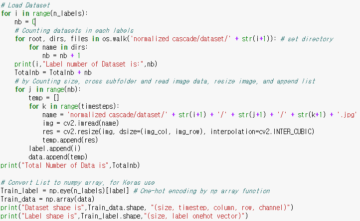

 

The code is described below.
We will use a normalized cascade dataset that can be retrieved from the server. If it is not decompressed, you need to unzip it before you run this code.

 

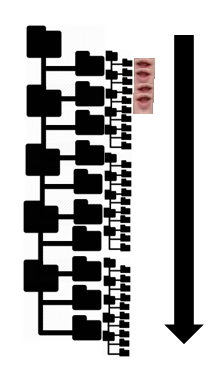

 

 

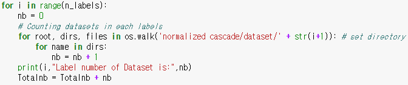

 

First, each subfolder is searched and the number of data in it is read by OS library

 

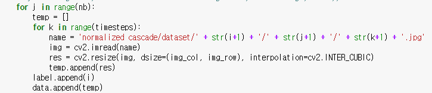

 

The data is stored in a subfolder in the form of a jpg image in numerical order, so it is read through the loop by OpenCV Library function imread.
At the same time, the image is scaled to the input size for transfer Learning by OpenCV Library function resize, and the label is stored after escaping the subfolder.

 

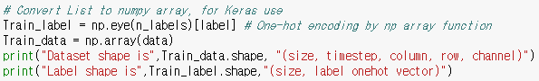

 

It is also converted to a numpy array type for use in Keras, and the labels are One_hot encoded by eye function.

 

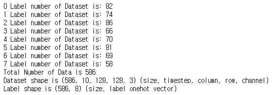

 

The result is as follows. In the case of input data, we can see that it has the same shape as the first input parameters to put into the model. The label is also made up of a stack of one-dimensional matrices.
And also, the dataset and its corresponding labels should also be shuffled to fit function
They must be shuffled in the same order, and for this, a random array corresponding to the data size is created and the shuffle proceeds in that order.

 

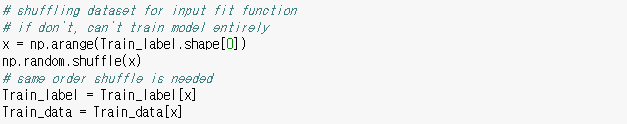

 

### 2.Building a Model

The model configuration consists of three steps.

1.	CNN model architecture declaration ( Transfer Learning model )
2.	LSTM model architecture declaration 
3.	Combine whole model CNN+LSTM model architecture 

It consists of Keras API functions. The code is shown below. 
The model architecture has been modified by the authors through several training processes.

 

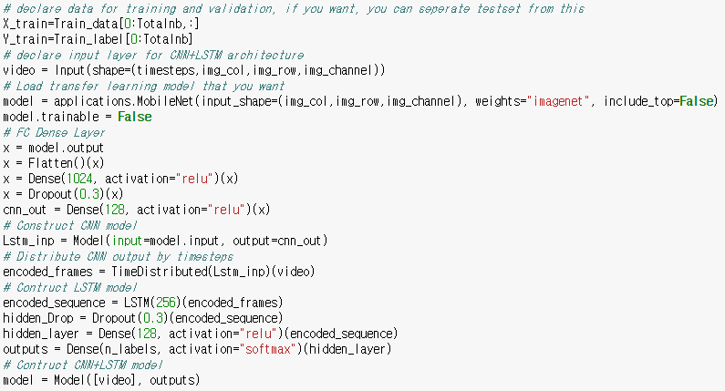

 

First, set up an input layer of type ( timesteps, col, row, channel ) for whole architecture

 

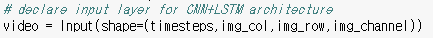

 

#### CNN model architecture declaration

 

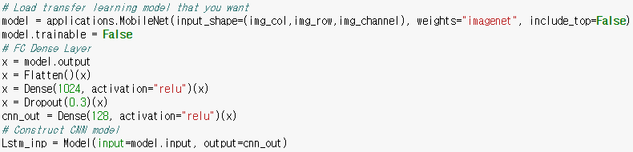

 

CNN model code is shown upper. 
We selected the MobileNet architecture with a relatively low weight as the transfer learning model considering the model size by adding the LSTM layer.
You can use other models like InceptionV3, ResNet50 etc.. by simple change of applications class name to this from MobileNet, but you must modify the required parameters as ( cols, rows, channel ) shape
The MobileNet receives specified image and returns the CNN code, which is set to be impossible to learn.
At the end of the CNN model, the dense layer consists of two sets of learnable states, which will be used as input to the LSTM layer, so the activation function is both ReLu. 
The dense layer has 1024, 128 nodes each and includes a dropout layer in the middle.
It is formed as an independent structure Lstm_inp and can be modified internally.
If you need more explanation, you can refer to Tutorial front for TransferLearning

#### LSTM model architecture declaration

 

 

LSTM model code is shown upper.
The important thing to know at this point is the TimeDistribute function supported by Keras.
This function takes the sequenced data and encodes its contents. As a model for encoding, we will use the entire CNN model.
To supplement this function with the previous data as an example, we have set the input to ( 10, 128, 128, 3 ) as the entire model input, so this is the input sequence.
The encoded_frames have a shape of ( 10, 128 ) because we put this into the CNN model with (128, 128, 3) input and we get the dense layer output ( 128 ) nodes
The LSTM layer receives this sequence and returns 256 nodes, which are computed as a probability value through a softmax function via a dense layer 128 node Relu activation with a dropout 0.3 ratio.

#### Combine whole model CNN+LSTM model architecture 

The weaving of such constructed models is done simply by using the Model function. By define input and output layer

 

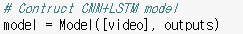

 

### 3.Setting up the Model Learning Process

 

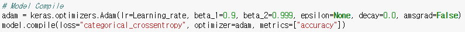

 

As the optimizer, we used the Adam optimizer which is generally known to have good performance and the default parameters are the default values. Details of this can be found on the Keras library website. Also, since we are classifying the classes, we set the loss function like this.
You can use this function to verify the model architecture, but this applies only to the post-LSTM part.
So if you want detail part of CNN architecture. You must refer to previous Tutorial for transfer learning

 

 

 

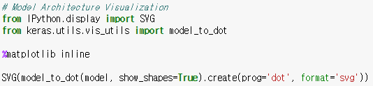

 

You can use this function to verify the model architecture, but this applies only to the post-LSTM part.
So if you want detail part of CNN architecture. You must refer to previous Tutorial for transfer learning

 

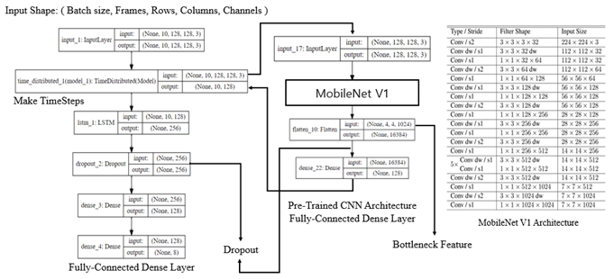

 

### 4.Training the Model

 

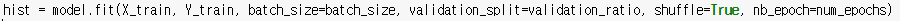

 

Since the generator is not specified in this case, the model fit() function is used. the whole data is put into memory instead of reading the data into the flow every moment, and the shuffled batch is extracted and used. Therefore, a very large data set will require special preprocessing in your case

 

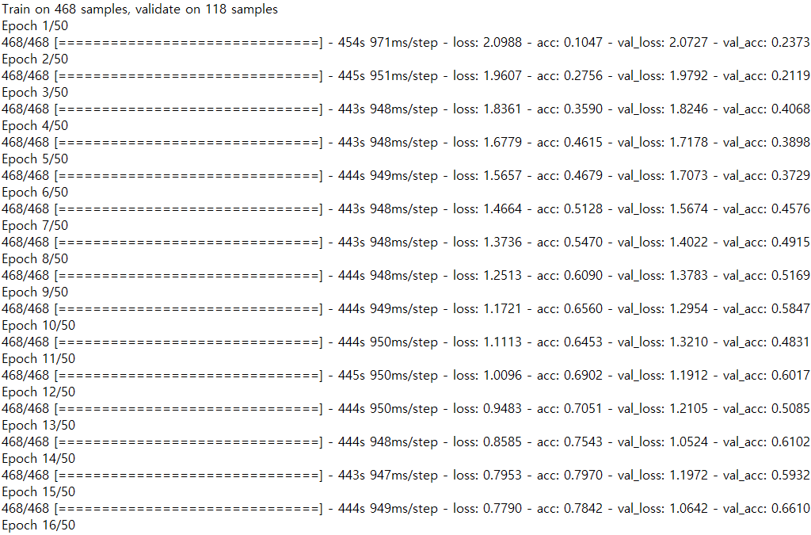

 

By running this function, you can observe the training process in real time as shown in the figure. This helps to stop immediately when judged that the wrong training is going on.

### 5.Confirm the Learning Process

 

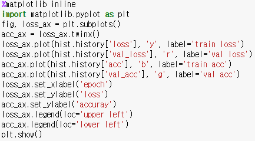

 

Visualizing the training process is exactly the same as the previous example, and works on any model if you only set the model name.
The green line represents validation acc and the red line represents validation loss, which is an important indicator of training. If, during training, the validation loss tends to increase without further decline, the model should be discontinued because it is overfitting.

 

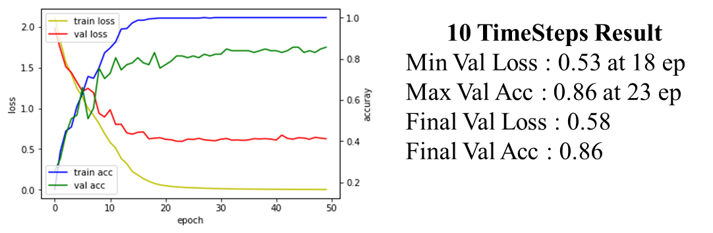

 

### 6. Using the Model

 

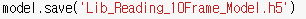

 

You can save the model to the name you want by h5 format datatype.
One thing to note is that it takes up a large amount of capacity because it has a re-trainable graph structure.

### 7 Using the Model on Other Dataset

**Reference 'Lip Reading Tutorial Test'**

Let's apply it to a new set of lip sequence data that is formed in a different way. We start by loading the library first.

 

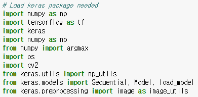

 

Loading a model is also possible with a simple function.
It should be noted here that in some cases, some transfer learning models have to define them using user-defined functions, such as MobileNet.

 

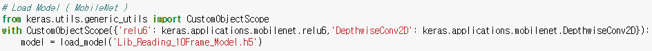

 

This can be solved with the CumtomObejectScope() function. For each model, you should refer to the Keras library for more information. Most models do not have this problem.
The code to fetch the dataset is completely similar to the previous one.

 

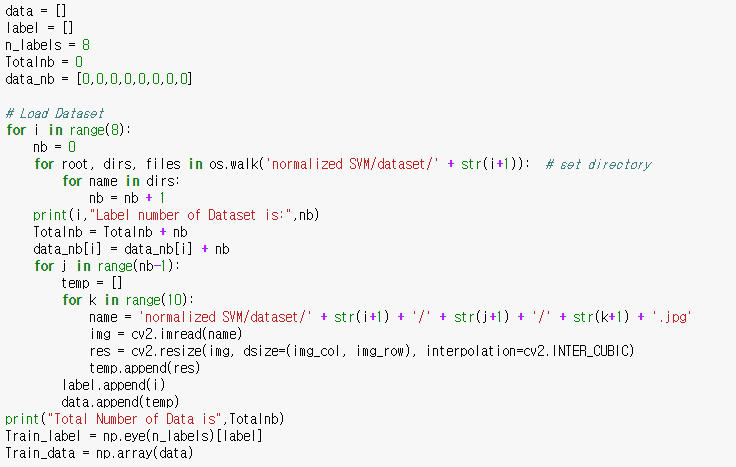

 

 

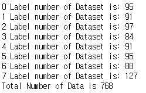

 

You do not need to apply shuffle in your data evaluation, but you can do it if you like.

 

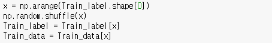

 

The code for evaluating the model looks like the side, and the loaded data is evaluated by the step by step one by one.
Each n variable is the number of correct answers, and npp is the total number of correct answers.
A detailed description of the code follows.

 

 

First set the loop as much as the size of the received data.
We then take the i-th array from the data, but note that the model's input always has a structure ( batch size, timesteps, col, row, channel ) You have to put in the data. Therefore, we have to add meaningless dimensions to the front axes. It can be done by expend_dim numpy function

 

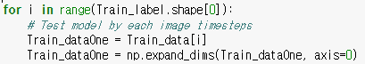

 

Then, the predict() function supported by Keras can be used to obtain the probability of each class of data passing through the loaded model. 
The batch size is 1 for each batch.

 

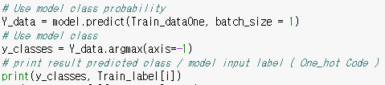

 

The argmax() function returns a number with the highest value on the specified axis, which can be used to obtain the label of the data most likely to be probable. The result is as follows.

 

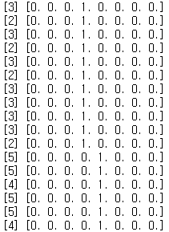

 

 

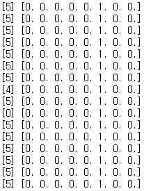

 

 

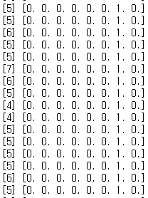

 

 

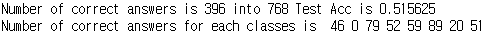

 

Overall, they showed about half the accuracy, and the results for each label are the same as the figure. If you like, you can check the sequence and access the folder, and you can see lip-shaped photos stored in image form to see how similar the model predicted.

 

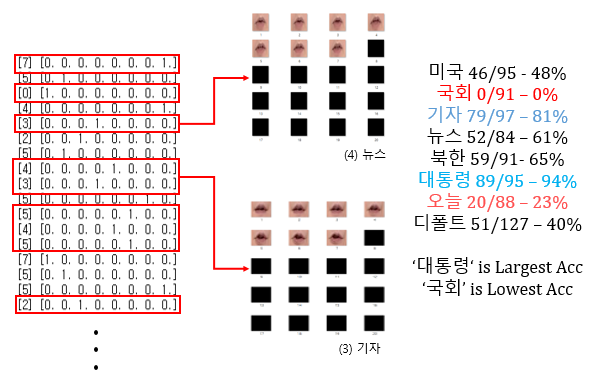

 

## Result

### Training Result

  After several trials, we set hyperparameters as below table.

 

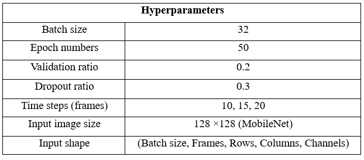

 

  The models trained with the conditions above showed the successful result of validation accuracy exceeding 80%. below three figures are training history of our models with 10, 15, and 20-time steps, respectively. Among 3 time steps (# of frames), 10-time steps showed the best result of 86% validation accuracy. Also, the graph of 10-time steps result, which was obtained by accepting only first 10 frames per video, is the most stable.

 

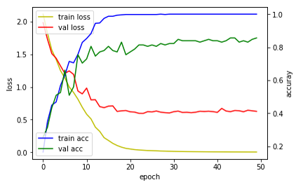 
**10-time steps result, final val loss : 0.58, final val acc : 0.86**

 

 

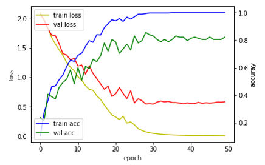 
**15-time steps result, final val loss : 0.58, final val acc : 0.82**

 

 

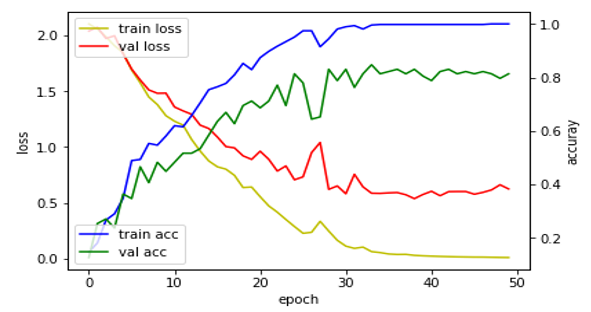 
**10-time steps result, final val loss : 0.62, final val acc : 0.82**

 

### Model test

  The trained model has been recorded as a ‘.h5’ file and then loaded again to test with the 768 datasets constructed by SVM-based lip detection algorithm. Below table is test accuracy for each dataset label. The model showed overall 51.6% accuracy for the test set. It appears that since the test set was preprocessed in a different way from the training and validation set, the test accuracy is lower than the validation accuracy.

 

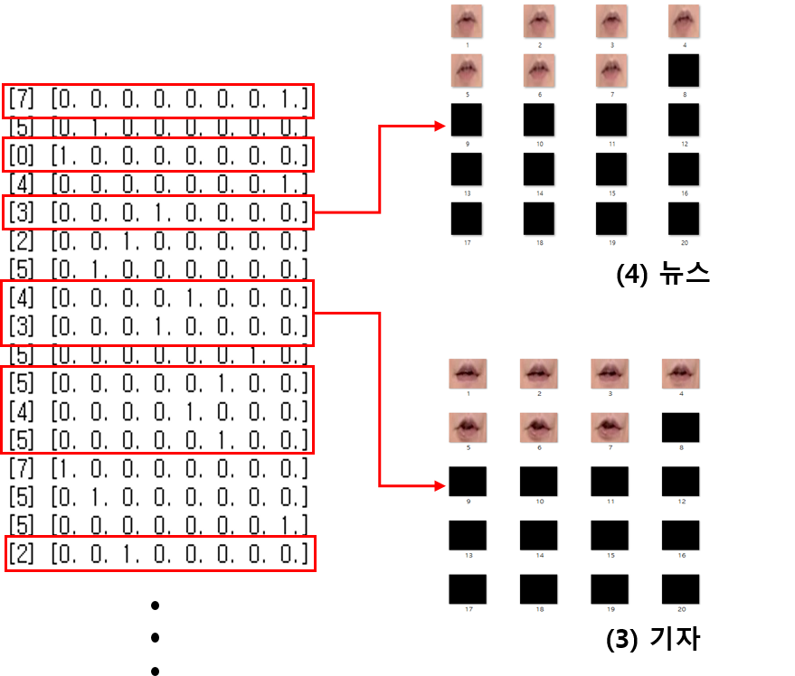
**Lip video classification with the trained model**

 

 

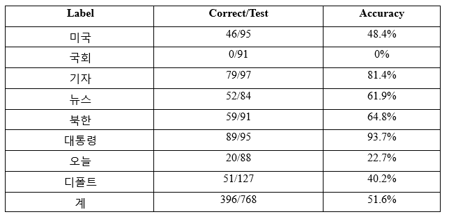

 

## Discussion

### Discussion

  What is worth our attention is that counterintuitively, the model trained with first 10 frames produces a better result in terms of validation accuracy. Since the first syllables of the seven words are all different, first 10 frames seem to have been enough to distinguish the selected words. Also, final lip shapes of the same labels differ when there come different postpositions(조사). Hence, models trained with longer frames show worse results. Since deep learning is “black-box method”, we cannot precisely know how the classification worked and exactly what factors have affected, but there are possibilities that the model classified the video by the length of padding not by geometrical features when the time step was longer than average video length. Though validation accuracy was about 80%, test accuracy was lower to be 51.6%. When it comes to specific labels, test accuracy for label ‘대통령’, which is uniquely 3-length syllable word, was about 93.7% while that for label ‘국회’ was 0%. The trained model seems to be tied to the training set, overfitted. It needs to be improved through repeated training with datasets of a wide variety.

  It seems that after transfer learning, the CNN with fine-tuned weight successfully extracted features from the lip. Since each label was made by one person, the classification perhaps was conducted by the other characters than geometry or bias in datasets. For example, the image has been resized twice during the preprocessing, and this may have caused the extent of lossy of images to affect the classification.

### Constraints and limitations

  Since the time and resources were limited, there exist limitations in this project. It was unable to use better CNN models than MobileNet such as VGG, due to the lack of memory and time. The number of labels and the number of the dataset for each label also quite limited. The type of dataset is confined to standard anchor case only. The characteristic feature of Korean grammar ‘조사’ made this project even more difficult, the existence of ‘조사’ changes the final shape of the lip even though the same person is speaking the same word. Lastly, our model is made to produce output once when 20 frames are given. If we fix the model to give the output for real-time video, we could conduct a webcam demo.

### What you can learn from the tutorial

This tutorial mainly comprises three parts. This tutorial, first of all, covers the architecture of CNN and LSTM. Students can get to know basic concepts and objectives of each structure and how to implement those neural network structures using python codes. Detailed techniques and hands-on practices for transfer learning were introduced, as well. Also how to train a model, back propagation, plotting loss and accuracy can be learned through this tutorial. How to prepare data in forms of image and video has been additionally dealt. Specifically, basic image processing techniques such as cropping, resizing, and computer vision algorithms such as cascade classifier, SVM-based detection, etc are introduced.

### Future works

We here propose several future works. By the time completing our tutorial, students will be capable of challenging these problems. First, extending current work to the entire Korean syllable would be an interesting work. Second, considering the context in lip reading by taking word sequence in the neural network to distinguish words with similar lip shape would be a meaningful work. We can also apply our model architecture to other languages. Lastly, by fusing audio data and lip reading data, it would be possible to increase the accuracy dramatically.
