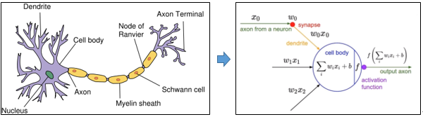
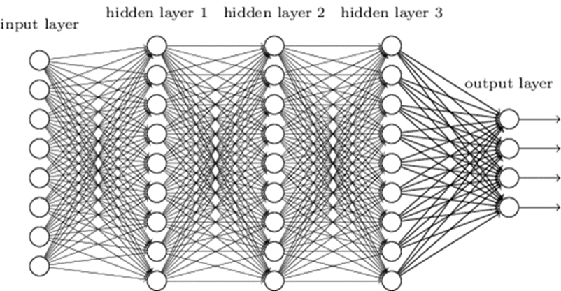
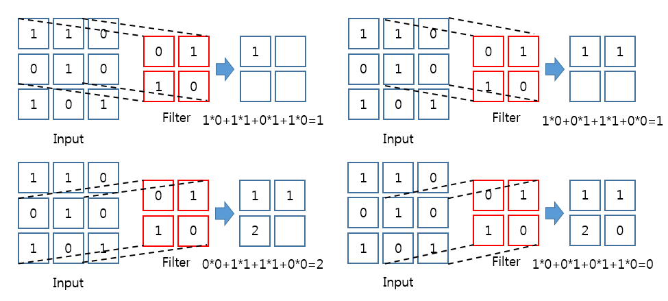
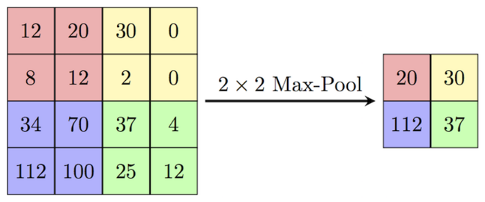
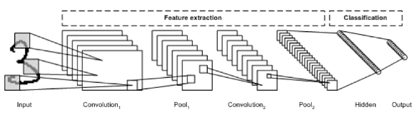
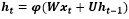
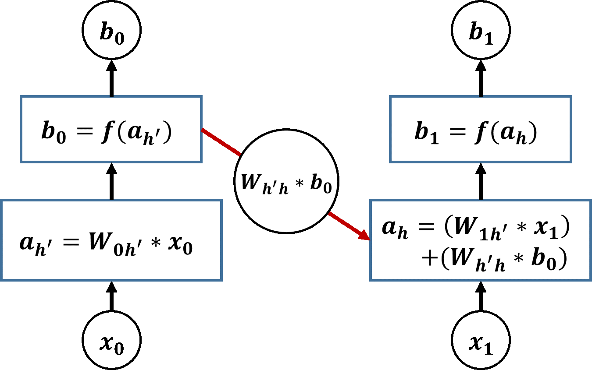
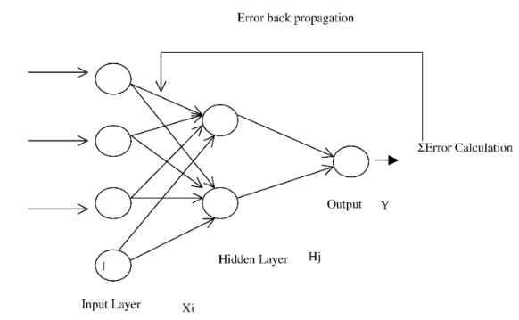
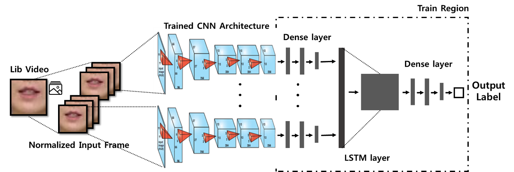

# Lip-reading-by-CNN-and-LSTM-architecture

## Introduction
  This deep learning project is about Lip Reading which is a technique of understanding speech by visually interpreting the movements of the lips so, we implemented this Lip Reading by using deep learning. It can be used for hard-of hearing people or to get some information from video without sound.
### Objective

  Lip Reading relies on the kind of the language and, in this project, **we chose Hangul as the language to implement the Lip Reading**.

  Because there were no Hangul lip datasets available for deep learning, it was necessary to create the datasets manually. Therefore, to recognize the overall general terms of language, not only does it require a large number of datasets, but also the size and complexity of the neural net increases. Due to time and hardware limitations, **this project defined the problem by classifying only a few words**.
### Precedent research & Reference

  There are some precedent researches which are related to this project as follows :
  
  * Garg Amit, Jonathan Noyola, and Sameep Bagadia. **Lip reading using CNN and LSTM**. Technical report, Stanford University, CS231n project report, 2016.
  
  * Gutierrez, Abiel, and Zoe-Alanah Robert. "**Lip Reading Word Classification**".
  
  * Parth Khetarpal, Shayan Sadar, and Riaz Moradian. "**LipVision: A Deep Learning Approach**“, International Journal of Computer Applications, 2017.
  
## Background Knowledge for Deep Learning

### What is the deep learning?

  Deep learning is defined by class of machine learning algorithms that use diverse combination of nonlinear processing for abstract. The meaning of abstract is feature extraction and transformation. In other words, **teach computer to human’s way of thinking**.
  
  Deep learning is learned by using **artificial neural network**. So, we learn about artificial neural network in the next paragraph.

### Artificial Neural Network

  Artificial neural network is imitation of biological neural network as the word itself. First we learn about an artificial neuron. The below left side picture is representation biological neuron. The neuron is an electrically excitable cell, receive electrical signals from other neurons and then give this signal to other neurons.
  
 
  

 
 
  An artificial neuron is a mathematical function expressed as a concept of biological neuron. The artificial neuron receives one or more inputs(x). There exist individual weights(w) for inputs. If receive 3 inputs, then there exist 3 weights. The summation results is total sum of input(x) multiplied by weight (w) and bias input (b). This summation is passed through a non-linear function known as an activation function (f). The result value of activation function is an output of artificial neuron. This process is expressed in an above right side picture. There is many activation functions such as sigmoid, ReLU, softmax. The output can change by activation function even if same summation.
  
 
  

 
 
  Artificial neural network is compounded of artificial neuron. Neural network is composed of layer and the layer has several neurons. There is input layer, output layer and hidden layer. Each neurons are fully-connected as above picture. If the number of hidden layer increase, the neural network is called as ‘Deep Neural Network (DNN)’. And, deep learning use this deep neural network for learning model. In hidden layer, generally use ReLU for activation function. The meaning of ‘Training’ or ‘Learning’ in the deep learning is adjustment of weights. The detailed explanation of ‘Learning’ exists below.
 
  There are many types of neural network or deep learning model. In this text, learn about CNN and RNN that are used in our model and famous models.

### Convolution Neural Network

  Convolutional neural network is a class of deep, feed-forward neural networks, generally used to analyzing visual imagery. CNN is composed of convolution layer and pooling layer, flatten layer, fully connected layer. CNN can be separated region that feature extraction of picture and region that classification. The convolution layer and pooling layer are region that feature extraction. And, the fully connected layer is region that classification. The flatten layer is located in between this regions.

 
  

**The process of convolution product by 2X2 filter with 1 stride**

 

  The image is composed of pixels. Pixel is a real number. And, each pixel express RGB 3 real numbers is color image. For example, the data shape of 24X24 pixel black and white image is (24,24,1). If the input data is image, the number of weights increase prodigiously. By this problem, calculate summation and activation function about only adjacent region. This is concept of filter. The number of filter’s weights is same as filter’s size. For example, 3X3 filter has 9 weights. The meaning of ‘Learning’ in the convolutional neural network is adjustment of filter’s weights. The filter move on input data(image) and perform convolution product. The result value is located in present filter’s location. The distance interval of filter’s moving is stride. The matrix that composed of result values is called ‘Feature Map’. The ‘Activation Map’ is a result of applied activation function on feature map. So, the output of convolution layer is activation map. There can exist several filters. The output of convolution layer is smaller than input data.

  (Padding is a method for avoid reduction of data’s size by convolution layer. Stuff a shell of data with specific value generally 0.)

  Pooling layer accept the output of convolution layer as input data. By pooling layer, the data size is reduce and some feature are extracted. One of the pooling is Max pooling. The max pooling extract maximum value in the filter size. By max pooling, can reduce noise and minor elements. The below picture represents max pooling layer.

 

 

  Flatten layer transform 2D data such as matrix to 1D data. The data must 1D shape for input data of fully-connected layer. So, flatten layer is located in between convolution layer or pooling layer and fully-connected layer.

 

 

  This above picture is basic structure of CNN. Convolution layer and pooling layer are stacked repeatedly. And the output transform 1D data by flatten layer, the transformed 1D data input fully-connected layer. The output layer apply Softmax activation function for classification.
 
  In the “Basic Keras Programming tutorial code”, you can study how to construct the CNN model in the Keras.

### Recurrent Neural Network

  Recurrent neural network is typically used to find regular pattern. Sequence is the data that important order. RNN’s input is a sequence. Recurrent neural network consider present input data and previous input data.

 

 

  The above function express RNN in formula type. h_t is the hidden layer’s parameter values at time ‘t’. x_t is input at time ‘t’. If the W is huge, the x_t is more important than h_(t-1). The W is updated for reduction of error. The below picture represents simple structure of RNN.
  
 

 

  Conceptually, RNN use two input data that are present input and previous output. LSTM is one of the RNN.

### Dataset

  We need dataset for learning of deep learning model. So, dataset is an important part of deep learning. Dataset depends on the deep learning model. If the CNN model, the dataset is composed of image. If the RNN model, the dataset is composed of sequence. The dataset is important part of deep learning. Dataset is composed of input and corresponding answer such as label. Dataset is classified training dataset, validation dataset and test dataset.

#### Training dataset

  The training dataset used for learning that is to fit the weights of model.

#### Validation dataset

  Validation dataset is used to the tune hyper-parameters for find the optimum learning method. The hyper-parameter is a parameter whose value decide learning method. The number of hidden units is one of the hyper-parameters. Also, we can decide the number of repetition learning by using validation dataset. An increment of the number of repetition learning about same dataset is not always good method. When the evaluation by validation dataset degenerate with the increment of the number of repetition learning, this phenomenon is called ‘Over fitting’. So, we need validation dataset for hyper-parameter tuning and avoid over fitting.
  
#### Test dataset

  Test dataset is independent of the training dataset. This dataset use for test deep learning model that finished learning.

### Learning (Training)

  Now, this part is detailed explanation of the ‘Learning’ in the deep learning such as, how to fit weights and process of learning.

#### Back-propagation

  The object of learning is reduction of output error. Before the learning, the weights is initialized generally 0. Choose weights and then measure the error of output. Next, update weights with reflect the error for reduce the error of output. The repetition of this process is concept of ‘Learning’.

 

 

  Back-propagation is a method of update parameter for neural network. The back-propagation using ‘Gradient Descent’ method with ‘Chain Rule’. Solve a descent of function at a point and then move the point to low gradient. Repetition of this process for the point reach extreme value is concept of ‘Gradient Descent’. For this process, we need target function. In output layer, calculate loss function between target output and estimated output by present weights. Minimize of result from the loss function is target function for neutral network. There is several loss, generally choose softmax loss for classification. This loss function apply to ‘Gradient Descent’. The chain rule is used in calculate the effect of each weight about loss.
  
#### Process of learning

  There are important factors of learning, batch size and epochs. Batch size is the number of data for once update weights. Now, express this in situation student study workbook. If the batch size is 10, student can check the answer after solving 10 problems. The update weights occur after check model output and result label. The smaller batch size, the larger number of update. Epochs is the number of repetition learning. If the 5 epochs, the model learning 5 times about same dataset. Generally, the more epochs, the better. But, not always. As mentioned earlier, there is over fitting. The performance of model depends on the learning method such as different batch size and epochs. So, decision of batch size and epochs is important part of deep learning.

  In the Keras, use the function **fit( )** for learning the model.  model.fit(x,y,batch_size=?,epochs=?)  x is input data and y is label value that correspond answer of input data. The detail of **fit( )** function and usage with example in “Basic Keras Programming tutorial code”.
  
#### Visualization of learning process

Now, explain the visualization of learning process in the Keras. In the Keras, can get history object as return value of fit( ) function. In the history object, there is training loss value and accuracy, validation loss and accuracy each epochs. Use history function for get the history object. And then, graphical presentation of this values by using ‘matplotlib’ package. The detail and usage with example code of visualization of learning process in “Basic Keras Programming tutorial code”.

## Our Deep Learning Model (CNN+LSTM)\

### Transfer learning

  First, learn about the transfer learning before explanation of our model architecture. Using knowledge gained while solving one problem and applying it to a different but related problem is transfer learning. In other word, using the well trained model. Actually, many people don’t teach the model about CNN from the beginning. Because of the time and almost problem can solve by using already learned model. The important thing in here is that using transfer learning for similar model. There is well trained CNN model such as VGG and MobileNet.
  
### Model Architecture

  We use CNN and LSTM with several dense layer for lip reading. For lip reading, must realize the change of lip shape. So, we choose CNN and LSTM. CNN is realize lip shape and then each of the output of CNN become transform to sequence. Finally, LSTM realize pattern the sequence that contain the change of lip shape. Using this difference of sequences to classification.
  
 

**Simple Model Architecture**

 

 The above picture is simple architecture of our model. First, we transform the lip video to several frame images. We used the several frame images as input. Each fame image passes through the already trained CNN architecture. And then the output of CNN passes through Dense layer for transforming to LSTM layer input. The output of LSTM layer become next dense layer input. Finally, receive the output label by softmax activation function. Our train region is dense layer of CNN architecture to end part. This region is conceived in the above picture.
 
  We judged that the extraction feature of lip shape is almost same as the extraction feature of appearance. So, we decide using the transfer learning form the ImageNet trained model. And then only train the dense layer in the CNN. We choose the MobileNet for transfer learning model. MobileNet is compact model and user can resize within regular range. When we use VGG model, take about 3 hours for one epochs on our dataset and error occurred in LSTM layer. But, it take about 15 minute for one epochs. As a result, we choose MobileNet.
  
   For reading data, firstly counting each label’s number of dataset. And then, pile the lip shape image along the TimeSteps. For Keras input, transform the list to Numpy array. Finally, shuffle data and make batch for training. The final shape of dataset is (586,20,128,128,3) 586 is the number of datasets and 20 is TimeSteps(frame), 128X128 is size of image. 3 is the channels. (Color image)
   
   The region for making TimeSteps is composed of MobileNet and dense layer. In the dense layer, applied drop out. Drop out is one of the method to avoid over fitting. The output of this region enter LSTM layer as input. Output of LSTM passes through dense layer with one more drop out. Finally, the classification label is output. The detailed model architecture is conceived in below picture.
