# Casacding Lip Tracker Algorithm

 
  
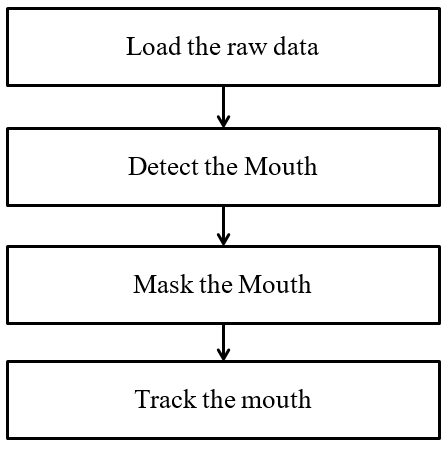 
**Cascading lip tracker algorithm**

 

## Load the raw data

### Import library - openCV, numpy, os

~~~python
import numpy as np
import cv2
import os
~~~

  This step contains importing library of python. Cv2, numpy and os means openCV, numpy, os library respectively. OpenCV (Open Source Computer Vision) is a library of programming functions mainly aimed at real-time computer vision. OpenCV’s application areas include: 2D and 3D feature toolkits, Facial recognition system, Motion tracking, etc. OpenCV is written in C++ and its primary interface is in C++. But there are bindings in Python, Java and so on. We will use the Python. Numpy is a library for the Python programming language, adding support for large, multi-dimensional arrays and matrices, along with a large collection of high-level mathematical functions to operate on these arrays. Os is a library for setting a path of the data. We will use os library to make a directory of the data.

### Load 'mouth casacade classifier' file

~~~python
mouth_cascade = cv2.CascadeClassifier('./node-opencv-master/node-opencv-master/data/haarcascade_mcs_mouth.xml')

if mouth_cascade.empty():
    raise IOError('Unable to load the mouth cascade classifier xml file')
~~~

  Function of openCV, cv2.CascadeClassifier is used to load a classifier file.

  (https://docs.opencv.org/3.4.1/d1/de5/classcv_1_1CascadeClassifier.html) 

  The classifier file is trained with a few hundred sample views of a particular object (i.e., a face or a car), called positive examples, that are scaled to the same size (say 20*20), and negative example – arbitrary images of the same size. The file studies with some features of particular objects, such as edge feature, line features, and so on. The word “cascade” in the classifier name means that the resultant classifier consists of several simpler classifiers (stages) that are applied subsequently to a region of interest until at some stage the candidate is rejected or all the stages are passed
  
 
  
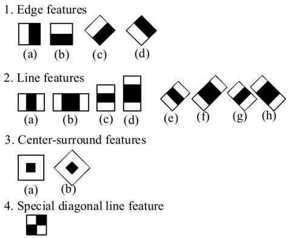 
**Features used by training**

 

  You can get additional information by site below.

  https://docs.opencv.org/2.4/modules/objdetect/doc/cascade_classification.html
  
  We used ‘Mouth cascade classifier’ file, “cascade haarcascade_mcs_mouth.xml”. This file is uploaded in Github. We just downloaded it, and used it. (https://github.com/peterbraden/node-opencv/tree/master/data) 

  If the file is empty, error would encounter you.

### Load raw data

~~~python
for i in range(1, 101):
    cap = cv2.VideoCapture('./deepset/news1/%d.avi' % i)
    # recommend avi file, mp4 file often cause some error for loading video
~~~

  We will load raw data from each label. Because the amount of raw data of each label is 100, ‘for’ statement has to be repeated 100 times.
  
  **Cv2.VideoCapture** is the function of openCV. It is used to load a video. You can load a video file by typing a name of video file. If you type 0 in the function (cv2.VideoCapture(0)) instead of the file name, you could load your own webcam. 
  
  (https://docs.opencv.org/3.2.0/d8/dfe/classcv_1_1VideoCapture.html) 

### Take the first frame of loaded video

~~~python
    ret, frame = cap.read()
    ds_factor = 0.5
    height, width = frame.shape[:2]
~~~

  In the first row, ret means loaded video is empty or not. If the loaded video is empty, ret would return 0. If the loaded video is not empty, ret would return 1. ‘frame’ is the image of the first frame of the loaded video. 

  ‘ds_factor’ will be used by next step. 

  ‘frame.shape[:2]’ returns the size of image of the first frame. First one is the height of the image, and next one is the width of the image.
  
### Resize the frame

~~~python
    frame = cv2.resize(frame, (width, height), fx=ds_factor, fy=ds_factor, interpolation=cv2.INTER_AREA)
    j=1
~~~

  This step is resizing the frame to plug in the cascade classifier.

 
  
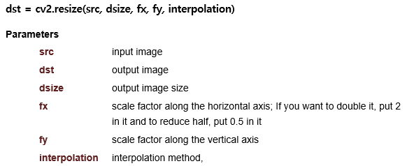 

 

  In OpenCV, it can be applied using the cv2.resize function. When the size changes, you have to determine the value between the pixels. The interpolation method is used here. Commonly used interpolation methods are cv2.INTER_AREA when reducing size and cv2.INTER_CUBIC, cv2.INTER_LINEAR when increasing size. You can practice some examples of cv2.resize on sites below.

  https://docs.opencv.org/3.4.0/da/d6e/tutorial_py_geometric_transformations.html
  
  http://opencv-python.readthedocs.io/en/latest/doc/10.imageTransformation/imageTransformation.html 
  
  ‘j = 1’ will be used to set the names of preprocessed file. 

## Detect the mouth

### Find a mouth

~~~python
    gray = cv2.cvtColor(frame, cv2.COLOR_BGR2GRAY)
    mouth_rects = mouth_cascade.detectMultiScale(gray, 1.7, 11)
~~~

  First, we need a color-space conversion. There are more than 150 color-space conversion methods available in OpenCV. Default color-space of image is BGR. We have to convert the color-space for grayscale to plug in the ‘detectMultiScale’, the function which is finding a mouth. So we will use ‘cv2.cvtColor’ function.
  
  Function, ‘cv2.cvtColor(input_image, flag)’ is used for color conversion where ‘flag’ determines the type of conversion. For BGR to Gray conversion, we use the flag ‘cv2.COLOR_BGR2GRAY’. Similarly for BGR to HSV, we use the flag ‘cv2.COLOR_BGR2HSV’.
  
  (http://opencv-python-tutroals.readthedocs.io/en/latest/py_tutorials/py_imgproc/py_colorspaces/py_colorspaces.html) 
  
  **mouth_cascade.detectMultiScale(gray, 1.7, 11)**
  
  cv2.CascadeClassifier.detectMultiScale(image, rejectLevels, levelWeights[, scaleFactor[, minNeighbors[, flags[, minSize[, maxSize[, outputRejectLevels]]]]]]) 
  
  This function detects objects of different sizes in the input image. The detected objects are returned as a list of rectangles.
  
 
  
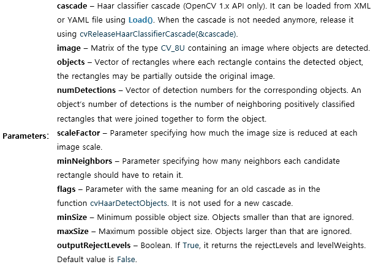 

 

  (https://docs.opencv.org/3.0-beta/modules/objdetect/doc/cascade_classification.html)
  
### Draw boundary box on the mouth

~~~python
    for (x, y, w, h) in mouth_rects:
      y = int(y - 0.15*h)
      cv2.rectangle(frame, (x,y), (x+w, y+h), (0,255, 0), 3)
      break
~~~

  ‘mouth_cascade.detectMultiScale’ returns a list of rectangles. This step is visualization of the detected mouth by drawing a rectangle. 
  
  **cv2.rectangle(img, start, end, color, thickness)**
  
  To draw a rectangle, you need top-left corner and bottom-right corner of rectangle. This time we will draw a green rectangle at the top-right corner of image.
  
 
  
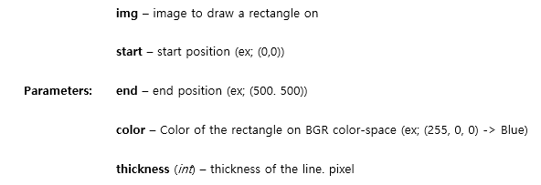 

 

  (https://docs.opencv.org/3.1.0/dc/da5/tutorial_py_drawing_functions.html)

  Example of this step: 
  
 
  
 
**Example of detecting mouth**

 

  Code :

  (https://www.packtpub.com/mapt/book/application_development/9781785283932/4/ch04lvl1sec41/detecting-a-mouth) 

## Mask the mouth

Mask means selecting special area (certain space, certain color, etc). Mask the mouth means that we will take the mouth only. 

 
  
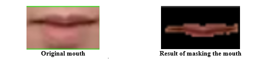 

 

### Set a ROI (Region Of Interest)

ROI is the boundary box on the mouth. We already found the ROI by drawing a rectangle on the mouth.

~~~python
    track_window = (x,y,w,h)
    roi = frame[y:y+h, x:x+w]
~~~

### Make a mask by setting threshold of ROI

~~~python
    gray = cv2.cvtColor(roi,cv2.COLOR_BGR2GRAY)
    ret2, mask = cv2.threshold(gray, 0, 255, cv2.THRESH_BINARY_INV + cv2.THRESH_OTSU)
~~~

  First row is conversion of color-space. We need grayscale color-space to make a mask. It is covered on **2-A**.

  Function, ‘cv2.threshold’ divides the brightness of the picture into two classes on certain threshold. Users can make the picture binary by setting the threshold of brightness.
  
  **ret, dst = cv2.threshold(src, thresh, maxval, type)**
  
 
  
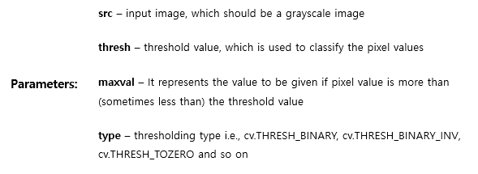 

 

For example of a shark image,

~~~python
import cv2
img = cv2.imread(‘shark.jpg’)
gray = cv2.cvtColor(img,cv2.COLOR_BGR2GRAY)
ret, thresh = cv2.threshold(gray, 70, 255, cv2.THRESH_BINARY)
cv2.imshow(‘Original’,img)
cv2.imshow(‘Mask’,thresh)
cv2.waitKey(0)
cv2.destroyAllWindows()
~~~
**Threshold value = 70**

 
  
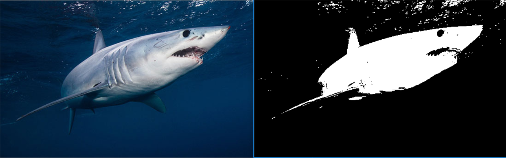 
**Result of threshold value = 70 (Left image is original, right one is image by using threshold)**

 

~~~python
import cv2
img = cv2.imread('shark.jpg')
gray = cv2.cvtColor(img,cv2.COLOR_BGR2GRAY)
ret, thresh = cv2.threshold(gray, 30, 255, cv2.THRESH_BINARY)
cv2.imshow('Original',img)
cv2.imshow('Mask',thresh)
cv2.waitKey(0)
cv2.destroyAllWindows()
~~~
**Threshold value = 30**

 
  
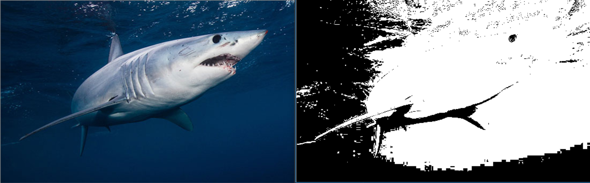 
**Result of threshold value = 30 (Left image is original, right one is image by using threshold)**

 

We can make a threshold image automatically by code below

~~~python
ret2, mask = cv2.threshold(gray, 0, 255, cv2.THRESH_BINARY_INV+cv2.THRESH_OTSU)
~~~
**Automatic threshold**

~~~python
import cv2
img = cv2.imread('shark.jpg')
gray = cv2.cvtColor(img,cv2.COLOR_BGR2GRAY)
ret, thresh = cv2.threshold(gray, 0, 255, cv2.THRESH_BINARY+cv2.THRESH_OTSU)
cv2.imshow('Original',img)
cv2.imshow('Mask',thresh)
cv2.waitKey(0)
cv2.destroyAllWindows()
~~~
**Auto-threshold**

 
  
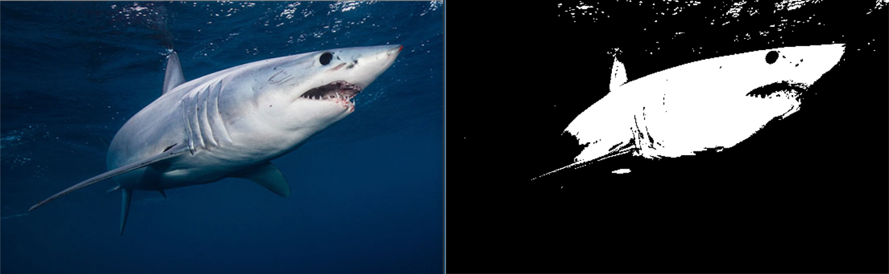 
**Result of Auto-threshold (Left image is original, right one is image by using threshold)**

 

  More information about threshold or auto-threshold, visit the website below.

  (https://docs.opencv.org/3.4.0/d7/d4d/tutorial_py_thresholding.html) 
  
### Make a 2D histogram of ROI from the mask

~~~python
    res = cv2.bitwise_and(roi, roi, mask=mask)
    hsv_roi = cv2.cvtColor(roi, cv2.COLOR_BGR2HSV)
    roi_hist = cv2.calcHist([hsv_roi], [0, 1], mask, [180, 255], [0, 180, 0, 255])
    cv2.normalize(roi_hist, roi_hist, 0, 255, cv2.NORM_MINMAX)
    term_crit = (cv2.TERM_CRITERIA_EPS | cv2.TERM_CRITERIA_COUNT, 10, 1)
~~~

**res = cv2.bitwise_and(src1, src2[, dst[, mask]])**

 
  
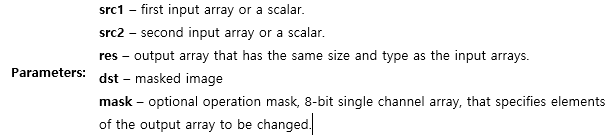 

 

‘**cv2.bitwise_and**’ mixes the original image and masked image.

~~~python
import cv2
img = cv2.imread('shark.jpg')
gray = cv2.cvtColor(img,cv2.COLOR_BGR2GRAY)
ret, thresh = cv2.threshold(gray, 0, 255, cv2.THRESH_BINARY+cv2.THRESH_OTSU)
res = cv2.bitwise_and(img,img, mask = thresh)
cv2.imshow('Original',img)
cv2.imshow('Mask',thresh)
cv2.imshow('res',res)
cv2.waitKey(0)
cv2.destroyAllWindows()
~~~
**Add just one row to make mixed image**

 
  
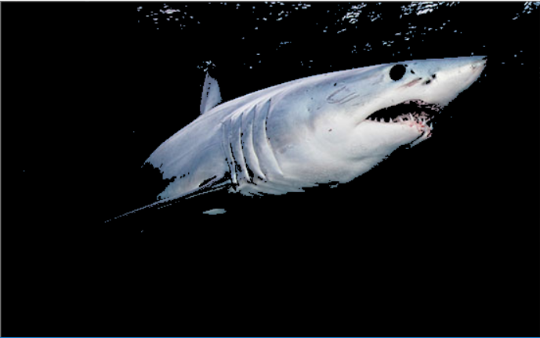 
**Mixed image(res) by adding just one row to make mixed image**

 

To make 2D histogram, we need to convert the color-space to HSV. You can get information about HSV color-space in website below.

(https://en.wikipedia.org/wiki/HSL_and_HSV)

**cv2.calcHist(images, channels, mask, histSize, ranges)**

 
  
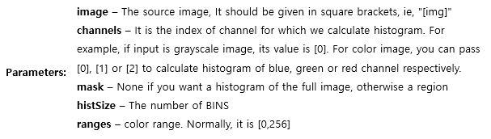 

 

  You can get some examples about it in website below.

  (https://docs.opencv.org/3.3.1/d1/db7/tutorial_py_histogram_begins.html)

  2D histogram uses two or more channels. Usually Hue and Saturation channels are chosen. We also use the Hue and saturation channels. 
In this step, we makes 2D histograms of mouth.

 
  
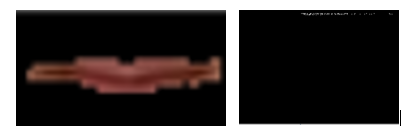 
**Mouth and 2D histogram of mouth (Hue and Saturation)**

 

Function, ‘cv2.normalize’ normalize the histogram. 

‘term_crit’ makes criteria, it is used by meanShift.

## Track the mouth

This stage is tracking the mouth. We do this because detecting lip every single frame increases the possibility of the error.

 
  
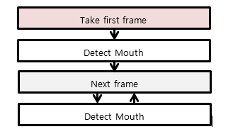 
**Not using mouth tracking algorithm**

 

 
  
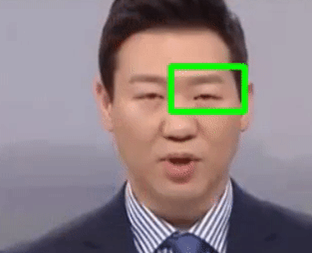 
**Error caused by detecting lips for every frame**

 

So, we use the mouth tracking algorithm. Once mouth is detected, track the mouth with image processing algorithms. **BackProject & meanShift** function is used for tracking

 
  
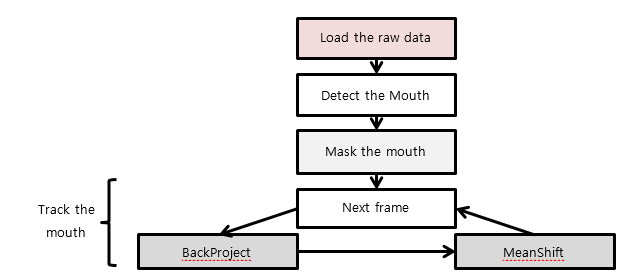 
**Mouth tracking algorithm**

 

### Take the next frame and make a folder to save the preprocessed data

~~~pyton
      while (1):
        ret, frame = cap.read()
        if not os.path.exists('./dataset/News/S%d' % i):
            os.makedirs('./dataset/News/S%d' % i)
        if ret == True:
~~~

  This step finds some directory for saving the preprocessed data. If this step does not find the directory, then it should make a directory like that above.

  You can move to the next frame of the video by using ‘if ret == True:’

### Backproject

~~~pyton
      hsv = cv2.cvtColor(frame, cv2.COLOR_BGR2HSV)
      dst = cv2.calcBackProject([hsv], [0, 1], roi_hist, [0, 180, 0, 255], 1)
~~~

**dst = cv2.calcBackProject(images, channels, hist, ranges, scale)**

 
  
 

 

  It is used for image segmentation or finding objects of interest in an image. In simple words, it creates an image of the same size (but single channel) as that of our input image, where each pixel corresponds to the probability of that pixel belonging to our object. In more simple worlds, the output image will have our object of interest in more white compared to remaining part.
  

 
  
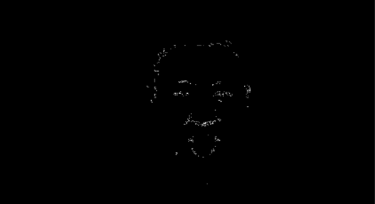 
**Backproject of the video**

   

Example of the backproject is below

(https://docs.opencv.org/3.3.1/dc/df6/tutorial_py_histogram_backprojection.html) 

### MeanShift

~~~pyton
            # apply meanshift to get the new location
            ret, track_window = cv2.meanShift(dst, track_window, term_crit)
            # Draw it on image
            x, y, w, h = track_window
            img2 = cv2.rectangle(frame, (x, y), (x + w, y + h), 0, 1)
~~~

The intuition behind the meanshift is simple. Consider you have a set of points. (It can be a pixel distribution like histogram backprojection). You are given a small window (may be a circle) and you have to move that window to the area of maximum pixel density (or maximum number of points). It is illustrated in the simple image given below:

 
  
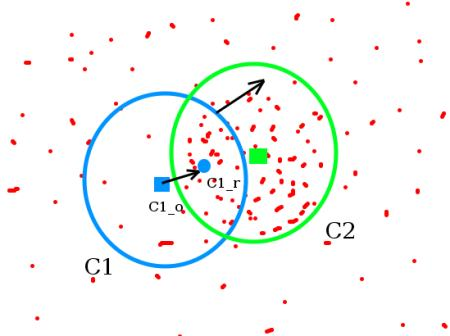 
**Principle of MeanShift**

   

The initial window is shown in blue circle with the name "C1". Its original center is marked in blue rectangle, named "C1_o". But if you find the centroid of the points inside that window, you will get the point "C1_r" (marked in small blue circle) which is the real centroid of window. Surely they don't match. So move your window such that circle of the new window matches with previous centroid. Again find the new centroid. Most probably, it won't match. So move it again, and continue the iterations such that center of window and its centroid falls on the same location (or with a small desired error). So finally what you obtain is a window with maximum pixel distribution. It is marked with green circle, named "C2". As you can see in image, it has maximum number of points. 

**ret, window=cv2.meanShift(image, window, criteria)**

 
  
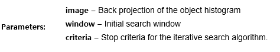 
**Principle of MeanShift**

  

You can get examples on site below
(https://docs.opencv.org/3.4/db/df8/tutorial_py_meanshift.html)

### Save the preprocessed data

~~~pyton
            lip = frame[y:y + h, x:x + w]
            video = cv2.resize(lip, (64, 64), interpolation=cv2.INTER_CUBIC)
            cv2.imwrite("./dataset/News/S%d/%d.jpg" % (i, j), video)
            j = j + 1
~~~

This step is saving the image file for each frame of video by jpg format. Function, ‘cv2.imwrite’ allows us to save the image file. We need to resize the lip image with 64X64 sizes to meet the CNN+LSTM model.

 
  
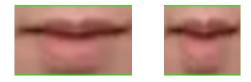 
**Mouth and resized mouth**

  

### Set quit key

~~~python
            k = cv2.waitKey(60) & 0xff
            if k == 27:
                break
            else:
                continue

        else:
            break

cv2.waitKey(27)
cv2.destroyAllWindows()
cap.release()
~~~

Function, ‘cv2.waitKey(delay)’ waits for a pressed key. Parameter, ‘delay’ means the delayed time, the unit is milliseconds. 

~~~python
import cv2

img = cv2.imread('lena.jpg', cv2.IMREAD_GRAYSCALE)
cv2.imshow('image',img)
k = cv2.waitKey(0)
if k == 27: # esc key
    cv2.destroyAllWindow()
~~~
**waitKey**

The number ‘27’ means ESC key. If you press ESC key in example 7, the program will be quitted because ‘cv2.destroyAllWindow’ destroys all of the HighGUI windows.

If you missed the quit key, the program would encounter the error.

